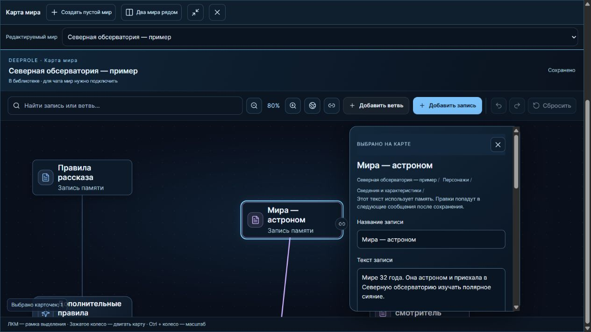
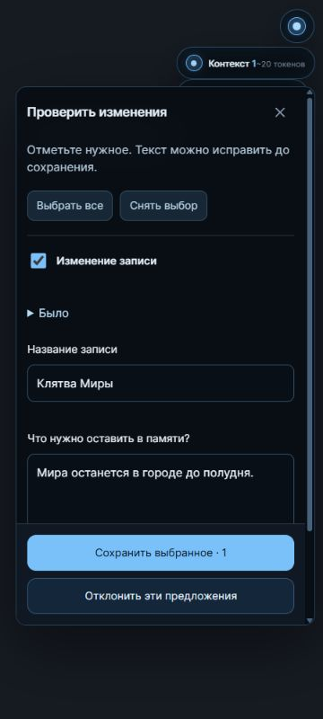

<div align="center">
  
  <h1>DeepRole</h1>
  <p>Ваш мир. Его история. Память, которую вы контролируете.</p>
  <p>Помощник для ролевых чатов в DeepSeek — с картой лора и подтверждаемыми обновлениями.</p>
  <p><a href="#быстрый-старт">▶ Начать</a> · <a href="INSTALL.md">↓ Установить</a> · <a href="docs/README.en.md">English</a> · <a href="PRIVACY.md">Приватность</a> · <a href="ROADMAP.md">Планы</a></p>
</div>

> Ранняя версия 0.1.0. DeepRole — независимое расширение, не продукт DeepSeek. Перед переустановкой сохраните резервную копию.

[Скачать сборки этой версии](downloads/README.md) · [Продолжить разработку на другом ПК](docs/CONTINUE-TOMORROW.md)

## Быстрый старт

1. Откройте чат на [chat.deepseek.com](https://chat.deepseek.com/), затем **DeepRole → Лор**.
2. Нажмите **Создать свой мир** или **Загрузить готовый лор**. Поддерживаются JSON из BDS, пакеты DeepRole и [простой формат записей](examples/observatory.json).
3. Выберите **Использовать в этом чате**. Импорт хранит мир в библиотеке; подключение выбирает его для разговора.
4. Добавьте факт через **Запомнить**. В **Игре** или индикаторе контекста посмотрите, что получит DeepSeek с вашей следующей репликой.
5. Играйте. После важного события нажмите **Обновить лор**, отметьте нужные предложения и **Сохраните выбранное**.

Пустая библиотека — нормально: ваших миров ещё нет. Учебный пример не участвует в чатах; его можно скопировать для редактирования.

## Персонажи и портреты

Карточки персонажей включены по умолчанию. Подключите мир и продолжите чат: после ответа DeepSeek появятся карточки участников. Можно сразу добавить персонажа кнопкой **+**. Нажмите имя, чтобы изменить анкету, состояние и портреты. Настроение и показатели сохраняются отдельно для каждого чата; исходный лор не переписывается. Скрытых дополнительных запросов нет. Отключить карточки можно в **Настройки → Приложение → Персонажи**.

Отметьте **«Мой главный герой»** в своей карточке — его портрет появится слева от вариантов ответа, первый собеседник справа. Остальные участники тоже видны: разговор с другим человеком не убирает персонажа из сцены. Несколько людей могут одновременно быть **«Собеседником героя»**. Можно загрузить свои изображения для разных эмоций; без них используются силуэты. Картинки не расходуют токены и не отправляются модели, текст анкет — расходует. [Как это работает, ограничения и резервные копии →](docs/CHARACTERS.md)

Портреты отделены от фона вариантов. **Перетащите имя**, чтобы переместить портрет; **потяните нижний правый угол**, чтобы изменить размер. Изображение всегда остаётся 3:4. Расстановка сохраняется автоматически для этого чата и мира. **Сбросить расстановку** возвращает обычные позиции; общий сброс — в настройках персонажей. Нажатие на изображение открывает анкету.

В **«В сцене»** видны герой и текущие участники; **«Все»** открывает всю библиотеку с поиском по имени или псевдониму. Просмотр разных эмоций в анкете не меняет настроение. При обновлении портрета фокус клавиатуры сохраняется; повреждённая картинка заменяется обычным портретом или силуэтом, не удаляя ваш файл.

Под портретами видны первые два заполненных показателя, например энергия или доверие. Все остальные доступны по нажатию на портрет. Показатели берутся из сохранённой сцены — без дополнительных запросов, токенов и выдуманных шкал.

Справа не тот персонаж? Откройте его карточку → **Собеседник героя → Сохранить персонажа**. Выбор действует только в этом чате, без отправки сообщения. Следующий ответ DeepSeek может сменить собеседника по событиям сцены.

## Выборы в сценах

Когда к чату подключён мир, DeepRole просит DeepSeek завершать сцены с диалогом или возможностью действия четырьмя вариантами: доброжелательным, нейтральным, жёстким и неожиданным. Варианты появляются кнопками под ответом. Нажатие **подставляет текст в поле ввода**: его можно изменить или вовсе не отправлять. Пока текст не изменён, можно переключиться на другой вариант. Свой черновик DeepRole не подменяет.

В блоке **«Ваш ход»** портреты крупные: на широком экране — по сторонам от действий, на узком — над ними. Выбранное действие подсвечивается; подпись подтверждает, что оно в поле сообщения, а не отправлено. Когда фокус на вариантах, стрелки переключают кнопки, **1–4** выбирают действие. При наборе сообщения эти клавиши работают как обычно.

**«Текст целиком»** показывает длинные варианты прямо в карточке — без наведения мыши, отправки или изменения черновика. Стрелки учитывают реальную сетку, Home/End ведут к первому/последнему ходу. Старый вариант отклоняется в момент нажатия, если новая сцена уже появилась.

После возвращения в чат готовые варианты под последним ответом восстанавливаются из загруженной истории — **без нового запроса**. Если DeepSeek не дал варианты или нарушил формат, нажмите **«Предложить варианты»** под ответом. Кнопка отправит видимый запрос на четыре хода без продолжения сцены. При занятом черновике запрос не отправляется; после ошибки можно попробовать снова, автоматических повторов нет.

Переключатель **«Выборы в сценах»** находится рядом с индикатором контекста на странице DeepSeek и действует для всех чатов с подключённым миром. Варианты не ставят автоматические очки отношений и не записываются в лор. Реакция персонажа зависит от его характера и событий чата: жёсткий ход может его заинтересовать, а добрый — вызвать недоверие. Значимые последствия сохраняются через обычное подтверждаемое **«Обновить лор»**.

## Оценка свободного контекста

Индикатор рядом с чатом загружает историю **именно открытого чата** через внутренний маршрут DeepSeek и оценивает объём её текста. Прокрутка страницы больше не должна менять значение. Цвет показывает примерный остаток: зелёный — большой запас, жёлтый — половина, оранжевый — мало, красный — почти заполнено. Если история недоступна, индикатор явно пишет, что учитывает только загруженные сообщения, и сохраняет наибольшую увиденную оценку при прокрутке.

Это ориентир относительно [заявленного DeepSeek окна в 1 млн токенов](https://deepseek.com/en/news/v4-preview/), а не точный счётчик сервиса: вложения, внутренние инструкции, ветки ответов и возможное сокращение старой истории могут изменить фактический лимит. История и токен входа не сохраняются в DeepRole; из страницы передаются только агрегированные числа.

## Как память доходит до DeepSeek

**Ваша реплика → выбор записей DeepRole → запрос DeepSeek → ответ.**

DeepSeek не читает всю базу постоянно. Расширение добавляет выбранные записи к исходящему сообщению. Счётчик показывает подготовленную память, а не доказательство того, что модель её учла.

| Режим | Когда отправляется | Пример |
| --- | --- | --- |
| **Всегда** | С каждым сообщением в своей области памяти | «Не управляй моим персонажем». |
| **Автоподбор** (`called` в BDS) | Когда хватает совпадений и места в лимите | Факты о Мире — при разговоре о Мире. |
| **Вручную** | После включения в этом чате | Секрет, который пока рано раскрывать. |

Автоподбор — **поиск по баллам, не ИИ**. Учитываются ключевые слова, название, текст, сцена, связи и приоритет. Одного совпадения бывает недостаточно. Примеры и объяснение доступны в **Настройках → Память**.

Отключение записи не стирает её из уже отправленной истории DeepSeek. Ручные включения и исключения относятся к конкретному чату; переключение мира их сбрасывает. Записи без мира доступны чатам без подключённого мира, а не являются заметками только одного чата.

## Карта и список — одна память



Персонажи, места, правила и события разложены по ветвям вокруг мира. Название и положение ветви помогают ориентироваться; сами по себе они не меняют факты и режимы записей.

- **Клик по карточке:** редактирование рядом с ней. **Двойной клик:** свернуть или раскрыть ветвь.
- **ЛКМ по фону:** выделить карточки рамкой. **Средняя кнопка или колесо:** перемещение карты. **Ctrl + колесо:** масштаб.
- **Ctrl+Z / Ctrl+Shift+Z:** отмена и повтор правок карты. **Сбросить:** вернуть организацию к состоянию при открытии, с подтверждением. Тексты памяти этот сброс не восстанавливает.
- **Связи:** справочные показывают отношения; связи активации могут подключать связанные записи. Последствия объясняются перед сохранением связи.
- **Два мира рядом:** редактируйте две карты, не переключая историю. Отметка «В этом чате» показывает, какой мир получает DeepSeek. Настройки сцены открываются поверх дерева; Escape закрывает настройки, оставляя карту открытой. Новый пустой мир создаётся в компактном окне; карта открывается по центру страницы без затемнения и разворачивается кнопкой в заголовке. Правое меню временно скрывается и возвращается после закрытия карты.

Карта сохраняется автоматически. Изменение текста в списке видно на карте — второй копии памяти нет.

## Обновление лора — с вашим выбором



**Обновить лор** отправляет видимый служебный запрос в текущий чат. Модель предлагает факты или правки. В проверке сначала виден короткий список предложений; раскройте нужное, сравните «было / станет» и отметьте его для сохранения. Изначально ничего не выбрано. Технический JSON скрывается уже во время ответа и заменяется подсказкой после обработки; объяснение модели остаётся видно. После перезагрузки страницы готовые служебные блоки скрываются снова.

Можно исправить текст, выбрать режим новой записи или отклонить всё с дополнительным подтверждением. Конфликтную правку можно явно превратить в новую запись. Существующие записи сохраняют свои режимы и связи. После подтверждения обновляются список и карта. Последний пакет можно отменить, пока его записи не изменили снова.

Модель может ошибаться или делать лишние выводы. Проверка — часть работы, не формальность. Пустой или нераспознанный ответ не меняет память. Обычная просьба «сохрани это» не заменяет кнопку и подтверждение.

## Три раздела

| Раздел | Зачем нужен |
| --- | --- |
| **Игра** | Мир и сцена текущего чата, память следующей реплики, запись факта, обновление лора, перенос истории. |
| **Лор** | Импорт, карта и список, персонажи, книги и заготовки. |
| **Настройки** | Подбор памяти, язык, резервные копии, локальный сейф. |

**Сколько писать?** Одна тема на запись, обычно 2–6 предложений. Разных персонажей и события удобнее хранить отдельно. В «Всегда» оставляйте только постоянные правила: они занимают место в каждом запросе. Это ориентир, не ограничение формата.

## Данные и правила

- Библиотека хранится локально в профиле браузера. Собственного сервера памяти и телеметрии нет.
- Выбранная память отправляется DeepSeek. Служебные запросы и ответы остаются в его истории.
- Сейф шифрует данные на устройстве, но не отправленные чаты и не старые обычные JSON. Потерянный пароль восстановить нельзя.
- Перед удалением расширения: **Настройки → Файлы и защита → Резервная копия**. Импорт мира/BDS и восстановление полной копии — разные действия.
- Не добавляйте в репозиторий личный лор, пароли и скриншоты переписки.
- Совместимость с другим расширением, меняющим запросы DeepSeek, требует отдельной проверки.

[Приватность](PRIVACY.md) · [Установка и обновление](INSTALL.md) · [Проверки и ограничения](docs/QA-2026-10-03-round8.md)

## Разработка

```sh
npm ci
npm run build
npm run build:firefox
npm run typecheck
npm test
npm run test:e2e -- --workers=1
npm run zip
npm run zip:firefox
```

Chrome/Brave: `.output/chrome-mv3`. Firefox: `.output/firefox-mv2`. Архивы: `.output/`. Сборка **не перезагружает установленную копию**: обновите DeepRole на странице расширений, затем перезагрузите DeepSeek.

Скриншоты выше показывают локальный демонстрационный интерфейс, не личную переписку. Реальные проверки модели и автоматические проверки указаны отдельно в отчёте.
