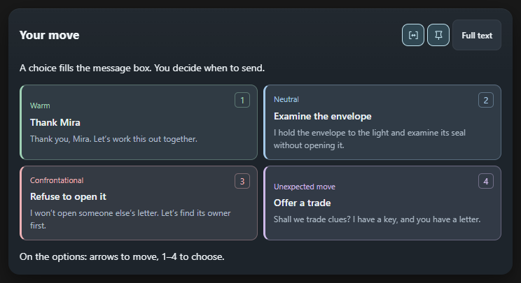
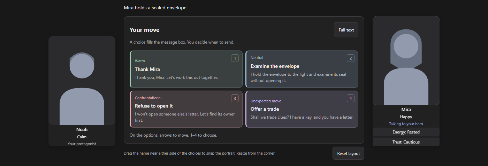
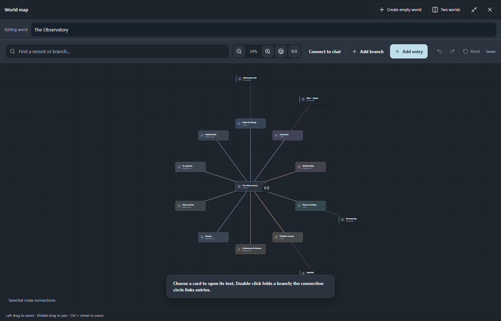
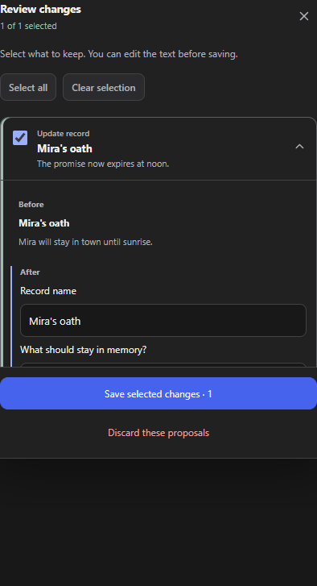

<div align="center">
  
  <h1>DeepRole</h1>
  <p>Memory and characters for roleplay stories in DeepSeek.</p>
  <p><a href="downloads/README.md">Download</a> · <a href="docs/INSTALL.en.md">Install</a> · <a href="docs/README.ru.md">Русский</a></p>
</div>

DeepRole helps you keep a long story consistent. Your worlds and characters live in your browser; the extension adds selected records to the messages you send through [DeepSeek](https://chat.deepseek.com/). Changes suggested by the model become lore **only after you review and approve them**.

> Early version 0.1.0. DeepRole is an independent project, not affiliated with DeepSeek. [Back up your data](#moving-your-data) before uninstalling or moving to another computer.

## See it in action

### Pick your next move

DeepSeek can offer four ways to continue a scene. Clicking a choice only fills the message box; you can edit the text or decide not to send it.



### Keep characters in view

Character cards show who's present, their mood and saved stats. Add portraits for different emotions, or keep the default silhouettes. Portraits can be moved and resized. Use the small **eye button** beside the panel controls to hide or show all portraits without deleting images or resetting their positions; the same switch remains in character settings.



### Organize lore on a map

The map and list are two views of the same records: people, places, rules and events.



### Decide what becomes memory

After an important scene, use **Update lore**. Review, edit and save only the suggestions you want.



*These screenshots come from the current interface with fictional demo data, not a private conversation.*

## Get started

1. [Download](downloads/README.md) and [install](docs/INSTALL.en.md) the extension. Chrome, Brave and Edge use the Chromium build. The Firefox build is currently a temporary add-on.
2. Open [DeepSeek](https://chat.deepseek.com/) and go to **DeepRole → Lore**. Create an empty world or import an existing one.
3. Choose **Use in this chat**. A world in your library is not automatically connected to a conversation.
4. Use **Remember** for a fact you want to write yourself. After the story moves forward, use **Update lore** to review DeepSeek's suggestions.

Already deep into a chat with no prepared world? Create an empty world, connect it to this chat, then choose **Update lore**. DeepSeek can propose the first records from the available chat history. Check them carefully; it may miss or misunderstand details.

## How memory works

DeepSeek does not have permanent access to your whole library. DeepRole selects records for each outgoing message. **Context** shows what is prepared for the next send; it cannot prove the model will use every detail.

| Mode | What it does |
| --- | --- |
| **Always** | Included with each message in its scope. Keep essential rules short. |
| **Automatic** | Selected locally from words, names and scene context when there is room. This is not a second AI search. |
| **Manual** | Included only after you attach the record to this chat. |

Records that do not fit are **not deleted**. Later messages can select a different set. Always-on and manually attached records take space separately from automatic matches. Check an over-budget warning in **Context**.

## Characters, portraits and choices

- Characters can be added by you or created with a new DeepSeek reply. Mood, condition, goals, relationships and stats belong to a specific chat. If the model provides no valid update, DeepRole keeps the previous values.
- To correct a lasting character fact, open the character sheet and choose **Correct a lasting fact**. DeepRole checks every lore record in the connected world and asks DeepSeek to suggest replacements in the records and character profile. Review each **before → after** change before saving. Existing chat messages are not rewritten; indirect mentions can still be missed by the model.
- Each emotion can have several images, shown in a non-repeating cycle. One image can be assigned to several emotions. Custom emotion names are not translated automatically.
- Scene choices appear below a completed reply. Technical choice data is hidden while it streams. **Suggest options** is a fallback if choices did not appear automatically.

[Character and portrait guide (Russian)](docs/CHARACTERS.md) · [Scene choices guide (Russian)](docs/SCENE-CHOICES.md)

## Moving your data

| Export | Includes |
| --- | --- |
| **World export** | One world with lore records, character sheets, portraits, image library and emotion settings. |
| **Full backup** | All worlds, settings, characters and saved chat states. Use this when moving computers or before reinstalling. |

A world export does not include each chat's current mood or portrait positions. Ordinary JSON from [Better Deepseek (BDS)](https://github.com/EdgeTypE/better-deepseek) transfers text memory, not images. Better Deepseek is a separate open-source extension; DeepRole supports importing its memory format. Exports without a password are not encrypted; a full backup can be password-protected under **Settings → Files & protection**. Do not upload personal lore to GitHub.

Images stay on your device: DeepSeek receives character and emotion text, not the image files. Selected memory and service requests are still sent to DeepSeek and remain in chat history. DeepRole has no memory server or telemetry. [Privacy policy →](PRIVACY.md)

DeepRole's importer acknowledges [Better Deepseek (BDS)](https://github.com/EdgeTypE/better-deepseek) and its creators for the original extension and memory format. DeepRole is a separate project.

## More information

- [Installation and updates](docs/INSTALL.en.md)
- [Characters and portraits (Russian)](docs/CHARACTERS.md)
- [Scene choices (Russian)](docs/SCENE-CHOICES.md)
- [Download builds](downloads/README.md), [development roadmap](ROADMAP.md) and [sample JSON lore](examples/observatory.json)
- [Russian guide](docs/README.ru.md)

## Development

```sh
npm ci
npm run typecheck
npm test
npm run build
npm run build:firefox
```

The source and tests live in this repository. Automated tests do not replace a check against a live DeepSeek account; changes to the site may require an extension update.
