<div align="center">
  
  <h1>DeepRole</h1>
  <p>Keep your world, characters and story progress together in DeepSeek.</p>
  <p><a href="downloads/README.md">Download</a> · <a href="docs/INSTALL.en.md">Install</a> · <a href="docs/README.ru.md">Русский</a></p>
</div>

DeepRole is a browser extension for long-running roleplay stories in [DeepSeek](https://chat.deepseek.com/). Keep lore in a local library, give characters portraits and relationships, and choose your next move without losing track of what happened.

**New: automatic reply recovery with conversation continuity.** A captured reply replaced by DeepSeek's refusal reappears with a **Restored** label. Send your next message: DeepRole includes the recovered fragment automatically, with no extra recovery button. [How it works ↓](#restore-a-hidden-reply-and-continue-the-scene)

You decide what becomes lasting memory. DeepSeek can suggest lore changes, but **they are saved only after you review and approve them**. Scene moods and configured progress update separately after story replies.

> Early version 0.1.0. Independent project, not affiliated with DeepSeek. Make a [full backup](#backups-and-moving-to-another-computer) before uninstalling, replacing your data or moving to another computer.

The current build adds relationship stages, numeric characteristics, visible consequences, personal emotion rules, one-click story continuation and a cleaner, adaptive interface. The examples below show the current UI in English; the [Russian page](docs/README.ru.md) has its own Russian screenshots. All examples use fictional demo data and built-in silhouettes, not a player's private lore.

## Start a story

1. [Install DeepRole](docs/INSTALL.en.md) and open a DeepSeek chat.
2. Open **DeepRole → Lore**. Create a world or import one you already have.
3. Connect that world to the chat. Keep important rules in **Always** memory; let other records appear when relevant.
4. Start playing. Open a character card to add portraits, set starting relationships or adjust their current state.

You do not need to configure everything first. When creating a world, you can optionally add your protagonist, other characters and their starting relationships. Starter energy and resolve scales are also optional. **Ask DeepSeek to propose lore** helps develop the setting; review its suggestions before saving them.

For an existing story, create an empty world, connect it to that chat and use **Update lore** to collect important facts. DeepRole does not invent numeric starting values from old prose: set those in the character sheets.

<details>
<summary>Example: create a world with a starting cast</summary>

<p>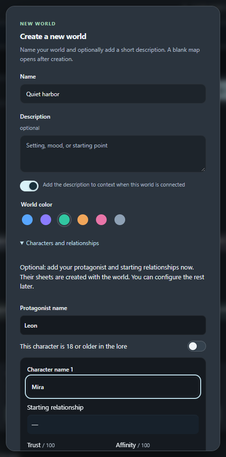</p>

</details>

## Choose your next move

DeepSeek can offer four ways to continue a scene. Clicking a choice fills the message box — **you can edit it, and you decide when to send it**. Use the arrow keys to move between choices and 1–4 to pick one.

Options receive the selected world memory and a reminder to follow its rules, including writing style. Keep must-follow rules, such as ending dialogue with an emoji, in **Always** memory. DeepRole does not strip emojis, but the external model can still miss an instruction.


While the story reply continues, your portraits stay visible. Hidden service JSON is replaced with a preparation message. Auto-follow continues through option preparation; scrolling up pauses it, and returning to the bottom resumes it while generation is still running. **Suggest options** is available when a finished reply has no choices. Returning to a chat restores readable saved choices when available.

<details>
<summary>A closer look at the reply options</summary>

The options match the message box width. Pinning keeps them above the input and leaves scrollable space after the last reply. Drag a portrait near either side of the options to snap it there; on narrow screens portraits use a compact layout. **−** minimizes the options, **□** restores the same card without changing your draft. Fresh options open for the next scene.

Scrolling up pauses auto-follow from the first movement; returning to the bottom resumes it. The wheel works over pinned options too: long cards scroll internally, then pass scrolling to the chat at their edge.

<p></p>

</details>

## Restore a hidden reply and continue the scene

When DeepSeek replaces a visible reply with “Sorry, that's beyond my current scope. Let's talk about something else.”, DeepRole automatically shows the last captured fragment with a small **Restored** label. Local copies belong to that chat and remain visible after a reload. This is enabled by default; the switch is in **Settings → App → Reply recovery**.

**Recovery also returns the fragment to the conversation context.** Your next ordinary message in the same chat carries the recovered story excerpt alongside your draft and current world memory. No manual restore-and-send step or separate model request is needed. This also works without a connected world.

| Step | DeepRole does |
| --- | --- |
| A visible reply is replaced | Restores the last captured text and saves a local copy. |
| You send your next message | Includes the recovered fragment as quoted assistant history. Explicit parent message IDs keep different branches separate. |
| The network request succeeds | Changes the label to **Restored · context sent** and records delivery. |
| You reload or keep playing | The readable copy stays; a delivered fragment is not repeatedly attached. A network failure before acceptance leaves it pending for your next send. |

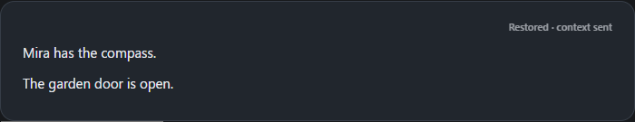

The fragment may be incomplete. A reply the extension never saw cannot be recovered. Only the latest applicable recovery is sent; very long text contributes its final **64,000 characters**, while the full local copy stays intact. Lore analysis and other service requests do not consume the pending fragment. Turning off Reply recovery or locking the vault also stops transmission.

The original server reply is not rewritten: the excerpt is added to your new request. This gives DeepSeek the text to reference, but does not guarantee its interpretation or prevent another refusal. Recovered copies and delivery markers are included in a full DeepRole backup and protected by the vault when enabled. The example above uses a fictional scene in an automated browser check, not a live DeepSeek account.

## Characters, images and emotions

**Prepare characters from lore** is enabled in the world creation and import dialog. DeepRole sends the saved story to a separate temporary DeepSeek chat, asks for the full roster including the protagonist, profiles, attributes, trust and affinity, then offers a review before saving. Scores include a rationale and source quotations. Existing profile text, images and played chat progress are preserved; unknown facts stay empty. The temporary chat is deleted through DeepSeek’s own controls after the result is received. A failed deletion is reported with a retry button. Existing worlds have **Create characters from lore** in Lore and a wand button in Characters. An empty world waits for its first lore records. Current limits: 40 characters, six numeric characteristics per character and 220,000 source characters per preparation. This uses your signed-in DeepSeek session, with no separate API key.

The wand's progress window opens beside Characters, aligned at the top. Drag its heading to move it; the reset icon docks it again. Small activity animations and rotating hints show that DeepSeek is still responding, not a made-up percentage. If DeepSeek replaces a **complete character-data reply already received** with a refusal, DeepRole keeps that data for validation and review, including after a service-tab reload. Incomplete or never-received data cannot be recovered; a refusal without a complete reply leaves profiles unchanged. This does not resend a prompt to bypass a refusal or alter the server's saved answer.

The editor has four tabs: **Profile**, **In scene**, **Relationships** and **Images**. The profile belongs to the world; current moods, goals and played progress belong to the chat. Switching tabs keeps your draft, and saving leaves the editor open.

Upload a batch to the **Image library**, then select pictures and assign emotions without reopening the file picker each time. You can assign the same picture to several emotions, or give one emotion several portraits. Portraits cycle without repeating until the set has been shown.

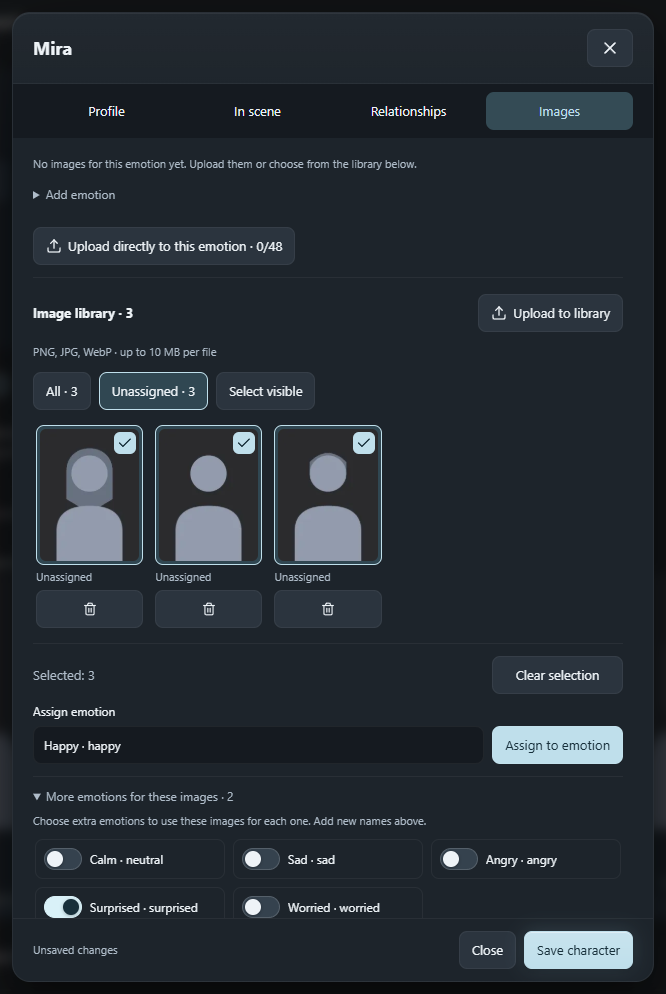

- Add a custom emotion directly in **Images**, or manage the world's list in **Settings → Characters**. Up to 32 emotions, 48 images per emotion and 512 unassigned images per character; PNG, JPG or WebP up to 10 MB per file.
- Built-in emotions show both their label and key, such as **Happy · happy**. Custom names are not automatically translated. Use the extra-emotion switches to share an image across names; commas and slashes in a name are not a shortcut for separate emotions.
- **Available emotions** lets you turn off specific moods for one character. All world emotions are allowed by default, and Calm remains available. DeepSeek receives the personal list. If it returns a forbidden mood, DeepRole keeps a valid previous mood or uses Calm; other valid changes still apply.
- Quick switches are immediately visible under **Images → Available emotions**. Turning one off detaches all its portraits when you save the character. Images remain in the library or their other assigned emotions; enabling it again does not restore old assignments. Removing an emotion from the world list and saving also detaches its portraits across that world. A missing portrait alone is not an emotion ban. Local mood checks cannot guarantee what DeepSeek writes in the story text.
- Drag portraits near either edge of the options to snap them into place, or move and resize them freely. Scrolling away from the options keeps their last screen position. Conversation partners use the main size; other present characters sit to their right, about 15% smaller and bottom-aligned. Multiple speaking partners use the same main size.
- Drag a portrait's corner to enlarge the full card up to the window height. That card becomes independent of automatic grouping and pinning; its manual size survives scene updates and refresh. Narrow windows fit it temporarily without overwriting the saved size. Reset layout restores the automatic group.
- The small **eye button** beside the panel controls hides or shows all portraits without deleting images or resetting positions. The same setting remains in **Settings → Characters**.

### Optional image generation

Connect your own image API in **Settings → Images**, grant access and load its current model list. DeepRole includes no preset provider, model inventory or prices. You can choose different connections for ordinary illustrations and non-explicit romance. Generation is off by default. Illustrations start when you click; a requested selfie can start automatically after the character agrees. Your provider’s rules and applicable law still apply; DeepRole reports refusals instead of bypassing them. Characters must be fictional.

**Where to start?** For the built-in native adapter, obtain a key from the [Venice API dashboard](https://venice.ai/settings/api). In DeepRole choose **Venice native API**, enter `https://api.venice.ai/api/v1` (not the website or a complete generation endpoint), save your key, grant API access and click **Load models**. Choose a generation model and, for character photos as inputs, a reference/edit model. Save the connection, assign it to the desired preset and enable image generation. Leave extra JSON parameters as `{}` until you need documented model-specific options. API use may cost money; check the provider’s current terms. [Official key setup](https://venice.ai/blog/how-to-use-venice-api), [live model catalog](https://docs.venice.ai/api-reference/endpoint/models/list).

An alternative is the [OpenAI Images API](https://developers.openai.com/api/docs/guides/image-generation), using DeepRole’s **OpenAI Images API** format. A service advertising “OpenAI-compatible chat” does not necessarily support image generation or editing. [Step-by-step setup and troubleshooting →](docs/IMAGE-GENERATION.en.md#where-to-get-images-and-an-api)

**No API needed for avatars.** Create and download portraits in a web image tool such as [Adobe Firefly](https://helpx.adobe.com/firefly/web/work-with-images/generate-images/generate-images-from-text-descriptions.html), or use your own artwork. Upload PNG, JPG or WebP into the character’s library and assign emotions. For a consistent face, keep one base portrait and create expression variants from that reference; consistency still depends on the image tool. Ready uploaded photos are displayed locally, not regenerated.

Click **Create illustration** below a completed story reply: a loading card appears immediately, DeepSeek privately describes that exact scene and selects its characters, then the image service creates the picture. No editor opens. Set optional **Image style** once in **Settings → Images**. Illustrations request **16:9** and generated selfies **9:16** by default; explicit connection sizing parameters are preserved. Provider results retain their pixel dimensions without local downscaling or cropping. Actual pixels appear below the preview; the full viewer offers 100% zoom. Older downscaled pictures cannot be automatically restored. **Try again** reuses the saved description, model, parameters and reference pixels, even after settings change. It makes a new paid attempt only when clicked. Retries replace the visible result in the same card. Back/forward browses saved generations for that reply, including while waiting or after a failure, without making API calls. History survives reload; deleting removes only the selected result. Keys stay separate and are not exported; illustrations and their retry snapshots are included in backups and world packages. [Setup, formats, limits and privacy →](docs/IMAGE-GENERATION.en.md)

### Character references, requested selfies and full image view

Use **Ask for a selfie** in Characters or ask by name in normal dialogue. Readiness is visible beside the action; relationship progress and **How to grow closer** are in **Character → Images → Generated selfies**. Existing drafts are preserved; the character can refuse. **Comfortable together / Close relationship / Character’s discretion** replace primary numeric controls; exact thresholds remain available.

Pin two optional **Permanent reference** looks in **Character → Images**: **Neutral** and **Suggestive**. Upload a photo or select one from that character’s library for each slot, and optionally describe when that look applies. DeepSeek selects the matching look and one or several people actually shown in the requested scene. Neutral is the fallback; without either image, generation uses textual appearance. Select Qwen Image Edit as your connection’s **Reference model** if that is the edit model you use. Without a reference, DeepSeek provides the visual frame; profile appearance stays authoritative, with lore-based visual details when it is blank. The existing lore-to-cast workflow creates the shared list of names.

With image generation enabled, a current selfie request and a verified, willingly sent photo event can start generation automatically. Descriptions and the pinned reference go to the configured image service, whose charges apply. DeepSeek receives text only. A saved receipt prevents repeat charges on reload; refused, deferred and unrequested events do not start generation. Failures require manual retry; downloading a finished result from a separately permitted domain does not regenerate. Importing a pending job does not authorize a paid request. Generated image timing depends on the provider.

DeepRole supports two selfie sources. **Uploaded selfie collections** show ready photos, **not AI-generated images**: you manually ask with **Ask for a selfie** or a message in the chat, and DeepSeek roleplays agreement/refusal and chooses the collection. **AI generation** creates a new photo through your separately enabled image service; provider charges may apply. Suitable ready photos are used first.

In **Character → Images → Uploaded selfie collections**, create collections with a name, context description and photos. Use **Add photos** to upload files, or **Choose from library** to select several of this character’s existing images, including assigned portraits and permanent references. **Add selected**, then **Save character**. Existing emotion/reference assignments stay unchanged; duplicates are skipped. Removing a collection photo does not remove its library source. Mark one collection as **Default collection**. DeepSeek chooses a category for the played scene; if none matches, it uses ordinary selfies. Images stay local: only collection names, context rules and availability are supplied to the model.

Each category has minimum trust and closeness (the affinity score), initially **40 / 30**. With relationship tracking set up for the protagonist, low saved scores block the attachment; high scores still do not guarantee consent. The character can refuse or defer according to personality, boundaries and the scene. Without numeric tracking, willingness is decided in the story. A refused, deferred or merely suggested action does not attach a photo.

After a completed reply with a valid photo event, the local image appears in that reply after about **1.5 seconds**. It is saved against that reply and restored after reload in the same browser and library. Removing the source image leaves a missing-photo notice. Up to 32 collections and 48 photos per collection, within the existing shared image budget. Older **Selfie / Селфи** emotion assignments are supported.

Click an avatar, selfie or illustration to open the image viewer. Use the **wheel** or **+/−** to zoom up to **128×**, drag to pan, or choose **100% / Fit to window**. Zoom-out stops at the fit scale. Keyboard: **+/−**, **0** for 100%, **F** to fit, **Escape** to close. Zoom enlarges the saved pixels; it does not invent missing detail. On floating portraits, the name still opens the character sheet.

### Sharper uploads, larger previews

New uploads keep up to **1920 px on the long edge**, rather than the former 384 px. In **Settings → Appearance → Uploaded image quality**, choose a preset or your own whole number from **256 to 4096 px**. Aspect ratio is preserved; smaller sources are never enlarged. A fitting PNG/JPG/WebP is kept without recompression when it fits the local size budget; larger pictures use high-quality WebP. This applies to portraits, selfie uploads and uploaded references, not the image provider’s output resolution. Old thumbnails need their originals uploaded again.

In **Character → Images → Image library**, move **Preview size** to enlarge thumbnails up to 280 px. The size is remembered; **View** opens the full picture without changing selection or assignments. Higher quality uses more storage; existing limits remain: 50 MB across uploaded portraits and 50 MB of combined images per world, with no automatic deletion of existing images.

<details>
<summary>See quality settings, large library previews and the image viewer</summary>

<p>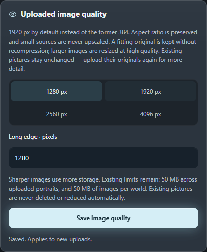</p>
<p>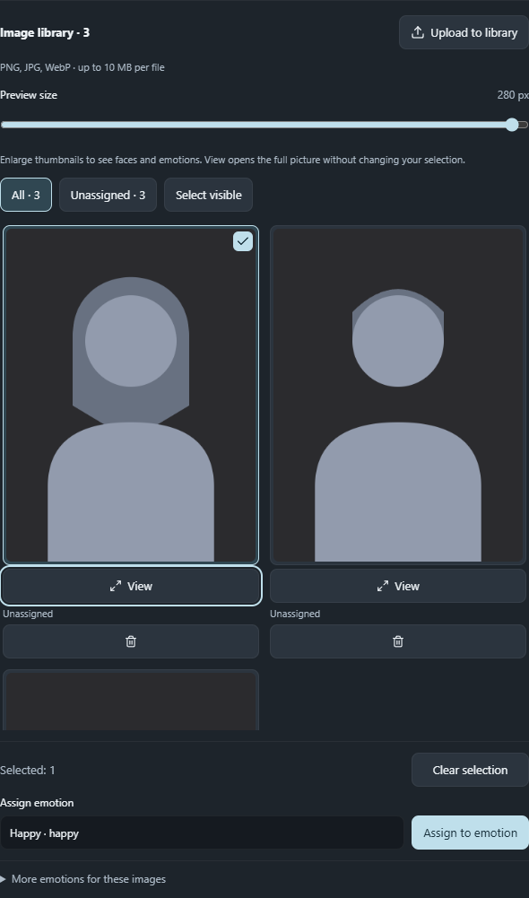</p>
<p>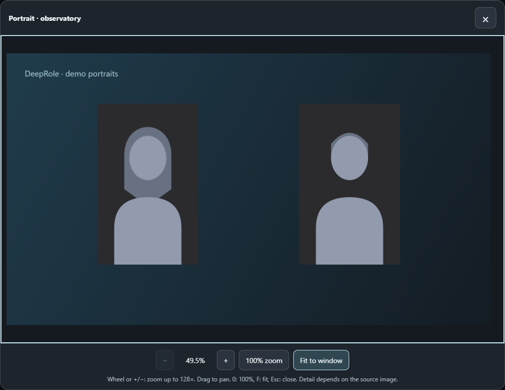</p>

</details>

<details>
<summary>Example: a character's personal emotion list</summary>

<p>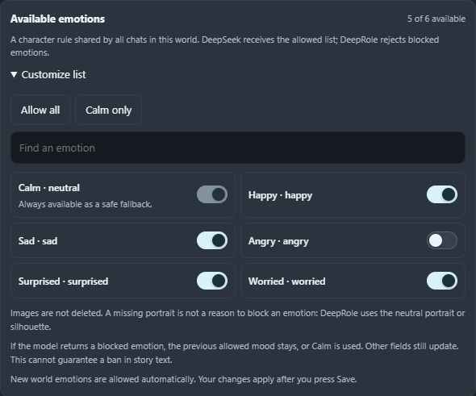</p>

</details>

## Relationships and consequences that persist

Track **Trust** and **Affinity** separately, from 0 to 100. Display numbers, a stage — **Guarded → Acquaintance → Trust → Closeness** — or both. Someone can like the protagonist without trusting them yet.

Set each character's starting values, personality, boundaries and pace of change. Important events can be required for closeness or kept as separate achievements. You can also describe how that character behaves at different stages; there is no universal “kind answer = +5” rule.

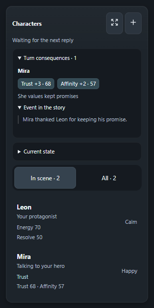

- After a played scene, DeepSeek proposes small changes with a reason and a quote. DeepRole checks the reply, scope, pace and repeated evidence before saving. Showing options or preparing lore does not award points.
- **Turn consequences** shows what actually changed and why. **Current state** explains scores and unmet conditions, so progress is not just a number.
- Edit current values, mark events manually or lock progress for this chat. The last 20 changes are kept in a journal. Undoing the latest model change opens a correction in the editor; review and save it yourself.
- Add up to six **Characteristics**, such as energy, resolve or courage. Each has its own 0–100 scale, starting value, low/high meanings, change limit and lock. Existing text stats are not silently converted.
- Starting settings belong to the world; played values belong to this chat and protagonist. Ordinary new chats start from their configured defaults. **Continue in a new chat** carries the actual progress forward instead.

The system is **on by default** and can be disabled in **Settings → Characters** without deleting scores or history. Older characters without configured scores keep their existing lore.

Romance is optional and off until configured for a character. Adult confirmation, individual conditions, willingness and boundaries still matter: **high scores are not consent**. These rules guide DeepSeek; they are not a guarantee of its response, and the extension does not rewrite ages in your lore.

<details>
<summary>Examples: relationship settings and a characteristic</summary>

<p>Choose starting relationships separately from the current chat's scores.</p>
<p>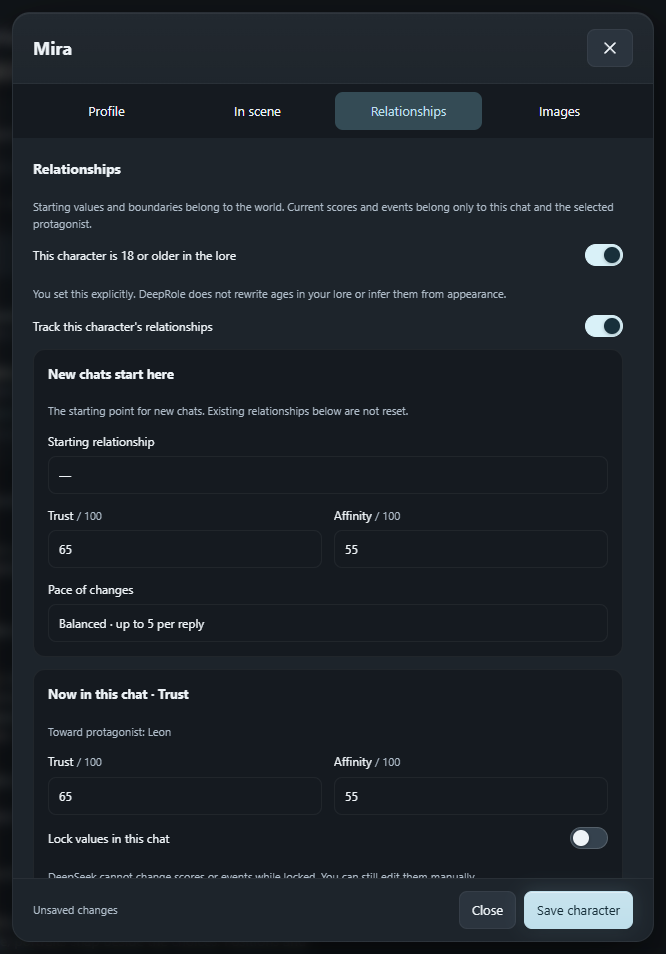</p>
<p>Define what a characteristic means, not just its name.</p>
<p>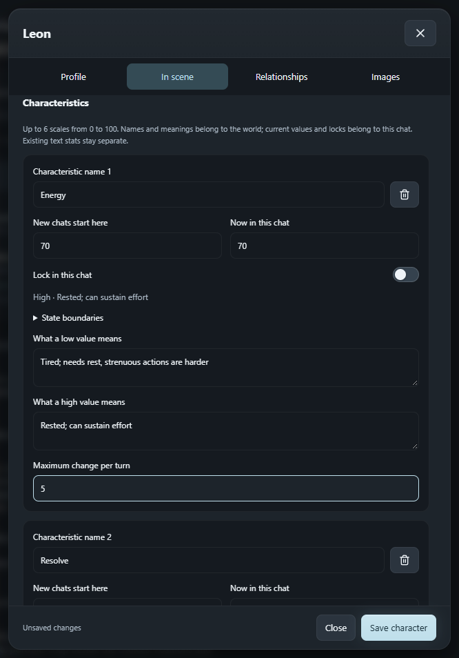</p>

</details>

[Relationship and characteristic guide →](docs/RELATIONSHIPS.md)

## Keep lore organized — and control changes

Worlds keep their own lore, profiles and memories. Use the list for direct editing or the **World map** to arrange branches, categories and links. Both views edit the same records. Search, drag nodes, open a full-screen map, compare two worlds side by side, or undo layout changes.


**Update lore** asks DeepSeek to suggest what is worth keeping after a scene. Review **Before → After**, edit the text and save only selected changes. Suggestions stay outside the saved lore until approved.

The brain-icon button beside the message field has a native browser tooltip explaining **Update lore** and the review step. If DeepSeek is busy, the tooltip also explains why the action is temporarily unavailable.

For a lasting correction, open a character and choose **Correct a lasting fact** — for example, change their hair color. DeepRole scans all memory records in the connected world and asks for proposed replacements in the lore and profile. You approve the changes; old chat messages are not rewritten, and the model may miss indirect references.


### What gets sent with a message?

Open **Context** to inspect the memory selected for the next message, attach a missing record or leave one out.

| Memory mode | When it is included |
| --- | --- |
| **Always** | With each message in its memory scope. Best for short, essential rules. |
| **Automatic** | When names, keywords and scene context match, within the automatic-selection budget. Selection runs locally, not through another AI. |
| **Manual** | Only when you attach it to this chat. |

Records that do not fit are **not deleted**. Different records may be selected for the next scene. Always records and manual attachments can go beyond the automatic budget, so check the size warning before attaching a large amount.

The **chat context meter** estimates the conversation's size; the **Context** badge estimates the attached memory. These are different measurements, not a bill from DeepSeek.

<details>
<summary>Example: inspect selected memory</summary>

<p>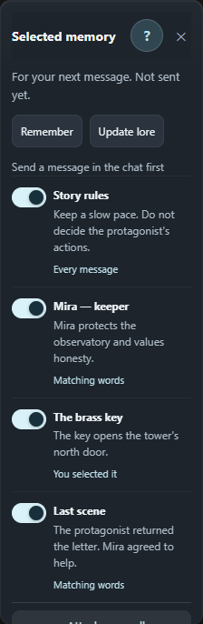</p>

</details>

## A calmer, adaptable interface

**Settings → Appearance** includes **Show thoughts automatically**. It is off by default: reasoning stays collapsed, while the “Thought for … seconds” header lets you expand an individual reply. Manual expansion survives streaming of that reply; subsequent replies start collapsed again. Enabling the preference restores DeepSeek's normal display across chats. **DeepThink**, requests and chat history are unchanged; the preference survives reloads.

Graphite surfaces, pale-blue accents, soft glow on important actions, iOS-style switches, matching dropdowns and thin dark scrollbars. Secondary actions stay quieter; animation can be turned off, and reduced-motion preferences are respected.

The floating panels below the chat title share one width: **224 px by default**, adjustable together from **200 to 360 px** using the toolbar or **Settings → App → Panels and scene**. Panels keep a 1 px gap. Drag a panel by its non-interactive area, or use the always-visible group handle to move the set. Reset returns it below the current chat title; closing DeepSeek's sidebar moves it smoothly into the freed space.

**Adaptive sizing is on by default.** Narrow windows use compact panel buttons and a portrait row instead of forcing large cards over each other. Your manual sizes are kept.

Two separate mini-buttons on the option card pin **both portraits together** or **the options themselves**. Pinned options stay centered above the message box, even when you scroll, resize the browser or grow your draft. If options finish while you are reading higher up, the pinned card appears on screen. Long cards scroll inside. Without pinning, they scroll with the story and stay clear of the composer at the bottom.

<details>
<summary>Example: shared width, adaptive sizing and pinning</summary>

<p>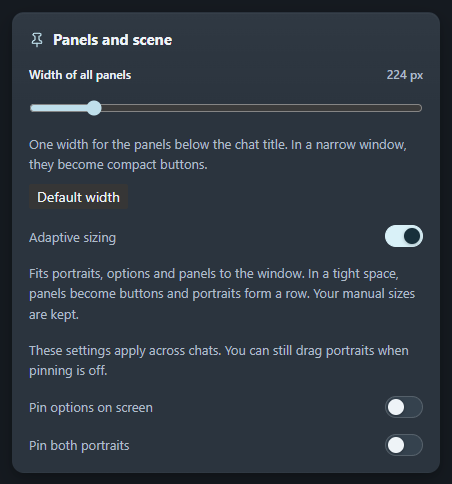</p>

</details>

## Continue in a new chat

Click **Continue in a new chat**: DeepSeek first compares the conversation with DeepRole memory and proposes updates. Review and save the changes you want, or explicitly continue with unchanged memory. DeepSeek then prepares a hidden summary of recent scenes; only after it is ready does a new chat open and receive the summary with a request to continue from the same moment. **The old chat is not deleted.** World, portraits, selected memory and exact saved character/relationship progress carry over.

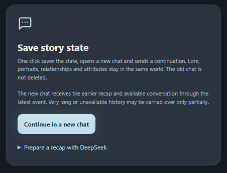

The summary is sent in the first request context; DeepRole displays only the continuation request in the chat, including after reload. The full transcript is not duplicated in the new chat. Missing history is not invented, and an AI summary may omit details; keep important facts in approved world memory. The saved checkpoint links back to the source chat.

Unsaved drafts and active generation are protected. If automatic sending is unavailable, send the prepared continuation yourself. If sending fails, it stays ready for retry. **Prepare a recap with DeepSeek** remains an optional separate action.

Near the configured chat capacity, an optional warning appears at about **90% and 97%**. It never blocks messages and can be disabled in **Settings → App**. This is a local estimate — not a prediction that DeepSeek will stop in exactly two messages. Estimated chat capacity is separate from the attached-memory budget.

<details>
<summary>Example: an early context warning</summary>

<p>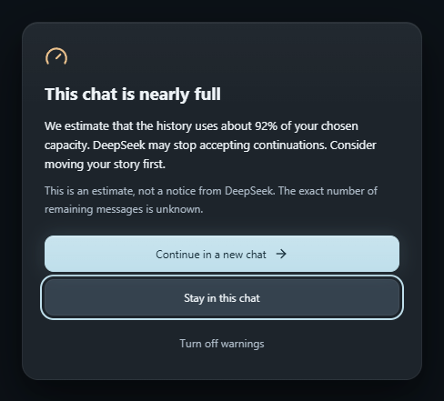</p>

</details>

## Backups and moving to another computer

### One JSON file. Your whole visual world.

**The pictures really travel inside the JSON.** Emotion portraits and their variations, unassigned library images, uploaded selfie collections and the images behind permanent references are embedded as image data, not external links. Saved illustrations travel too. It feels like a little magic: import one file and the cast has its faces again — no separate image folder or cloud account required.

1. Open **Settings → Files & security → Export**.
2. Choose **This world**, select the world and click **Download file**.
3. On another installation, use **Lore → Import existing lore** or **Settings → Files & security → Import**, choose the JSON and confirm the world import.

The file contains the stored versions, not discarded original upload files. Unsaved character edits must be saved first. More pictures make a larger JSON. Treat it as private: an ordinary world export is not password-encrypted. API keys/connections are not included, and exporting a world is not exporting the full DeepSeek conversation. For saved chat progress and all extension settings, choose **Full backup** below.

| What to save | What it carries |
| --- | --- |
| **Export world** | That world's lore, character profiles, images, emotions, personal emotion rules, relationship settings and starting characteristic values. Not the played progress of individual chats. |
| **Full backup** | All worlds, records, settings, saved chat states and played character progress. Use this when moving to another computer. |

Choose **Settings → Files & security → Export → Full backup**, keep the downloaded file somewhere safe, then import it into DeepRole on the other computer. Both **Settings → Files & security → Import** and **Lore → Import existing lore** recognize full backups, including password-protected files. Both open the same preview: add missing records without overwriting existing ones, or restore the full library and settings after explicit confirmation. World exports retain their separate world-import flow.

**Do not uninstall just to update.** Back up first, replace the files in the folder your browser loaded, reload DeepRole on the extensions page and refresh DeepSeek. A local rebuild does not update a separately unpacked folder automatically.

You can also import memory records from [Better Deepseek (BDS)](https://github.com/EdgeTypE/better-deepseek). That import does not include DeepRole's portraits or played character progress. GitHub downloads contain the extension, not your private worlds.

## Privacy and credits

Lore, portraits and progress are stored in your browser. Selected text and service requests go to DeepSeek; portrait bytes do not. If you separately enable image generation, your chosen image provider receives the final description and selected references only on your click. DeepRole has no separate memory server or telemetry.

The optional vault protects local extension data. It does not encrypt messages already sent to DeepSeek or ordinary backup files created earlier. Browser data can be cleared or lost, so keep your own backups. [Privacy details →](PRIVACY.md)

Respect and thanks to [Better Deepseek (BDS)](https://github.com/EdgeTypE/better-deepseek), the independent open-source extension whose memory format DeepRole can import. DeepRole is not its official version or a DeepSeek product.

## More help

- [Download current packages](downloads/README.md)
- [Install and update](docs/INSTALL.en.md)
- [Relationships and characteristics](docs/RELATIONSHIPS.md)
- [Character and portrait details — Russian](docs/CHARACTERS.md)
- [Scene-choice details — Russian](docs/SCENE-CHOICES.md)
- [Roadmap and verification notes — Russian](ROADMAP.md)

## Development

Requires Node.js and npm.

```sh
npm ci
npm run typecheck
npm test
npm run test:e2e
npm run build
npm run build:firefox
```

The source and tests are in this repository; ready-to-install archives are in [downloads](downloads/README.md). Automated tests use synthetic scenes. They do not replace checking a live DeepSeek account: changes to the site's interface may require an extension update.
