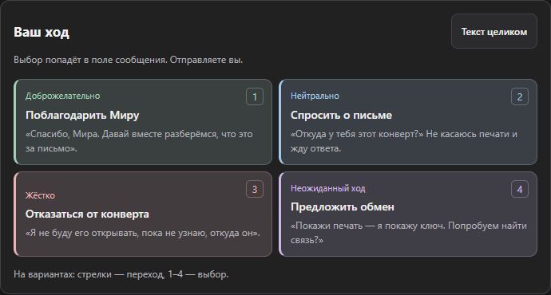
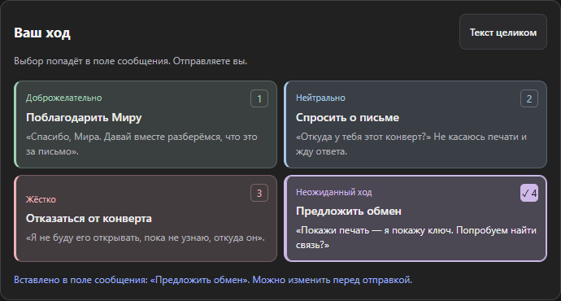

# Импорт Better Deepseek (BDS) и цвета вариантов

[Оригинальное расширение Better Deepseek (BDS)](https://github.com/EdgeTypE/better-deepseek) — источник импортируемого формата памяти.

## Что выяснено

- Проверен формат пользовательского файла локально: 60 записей, только `importance` и `value`. Ни структурированных анкет, ни изображений в нём нет. Текст файла не изменён и не перенесён в тесты или исходники.
- `buildBdsImport` создаёт мир с новым ID (либо добавляет книгу в явно выбранный существующий), книгу и записи. Он не создаёт сущности персонажей из свободного текста.
- Старое обновление персонажей связано с прежним ID мира/чата и версией карточек. Проверка не сравнивает содержание истории и не объявляет импортированный лор чужим. У новых ответов связь проверяется по принятому локальному запросу; защита от записи в другой мир, повторов и устаревших изменений сохранена.
- Ранее созданный личный набор из девяти PNG существует отдельно от Git и установочных пакетов. Изображения нужно загрузить в карточки. Они затем входят в экспорт мира DeepRole; полная копия дополнительно включает состояния чатов. Набор не стал встроенным, тестовым или временным.

## Изменено

- Варианты мягко окрашены сразу: доброжелательно — мята, нейтрально — голубой, жёстко — розовый, неожиданный ход — сирень. У каждого постоянный цвет фона, края и подписи; выбор усиливает тот же цвет и добавляет галочку. Тип по-прежнему написан текстом. Это тон действия, не оценка морали и не обещание реакции персонажа.
- Цвета вынесены в общие семантические токены OKLCH. Подход взят из [Color Expert через Lazyweb](https://github.com/meodai/skill.color-expert): низкая насыщенность, общая светлота акцентов, контраст проверяется численно. Никаких новых зависимостей и шрифтов.
- Предупреждение теперь явно касается **карточек**, а не всей истории. До импорта Better Deepseek (BDS)/обычного JSON видно, что переносится текстовая память, не анкеты с изображениями. Пустой список объясняет два способа добавить персонажа и отдельную загрузку портретов. RU/EN обновлены.
- Применены Testing QA (регрессии и визуальная проверка), i18n-localization (обе локали) и UX Copy (причина плюс следующий шаг). Автоматический разбор всех персонажей при импорте не добавлен; личная библиотека не изменялась.

## Проверка

- 462 unit/integration прошли; строгий TypeScript с проверкой неиспользуемого кода — без ошибок.
- 76 браузерных UI/E2E прошли в Chromium и Firefox: варианты, анкеты/изображения, импорт. Восемь новых цветовых сценариев повторены отдельно. Измерен контраст текста ≥4.5:1 и бокового акцента ≥3:1 для каждого типа в обычном состоянии, при наведении и выборе. Проверены доступность WCAG AA, клавиатурный фокус, галочка, восстановление после обновления, RU/EN и 320/900 px.
- 7 сценариев установленной production-сборки на нейтральном макете прошли: импорт Better Deepseek (BDS) RU/EN, пустой список персонажей при прямом/SPA-входе, привязка к принятому запросу, независимые библиотеки браузеров, правки и изоляция чатов. Новый пакет действительно содержит четыре разных цвета. Это не новый живой ответ DeepSeek.
- Обычное состояние, выбор, русский/английский и узкое окно просмотрены на снимках. Старые проверки мира/версии сохранены.
- Обе production-папки сборок и три ZIP обновлены, каждый файл архива сверён со сборкой/исходником по SHA-256. Личные изображения, JSON, тестовые профили и секреты не входят в установочные пакеты или архив исходников. Известное предупреждение Vite о крупных chunks остаётся. Работа сохранена локально, без новой публикации; полный контрольный снимок с тестами — `private-assets/deeprole-checkpoint-20261003-import-colors.zip`.
- Перезагрузка пользовательской установленной копии не подтверждена: Brave запрещает инструменту свою внутреннюю страницу расширений. Пользовательский мир не удалялся и не импортировался повторно, сообщения не отправлялись. Для загрузки новых файлов нужен ↻ у DeepRole и обновление DeepSeek. Для новых карточек — следующая реплика с подключённым миром.

