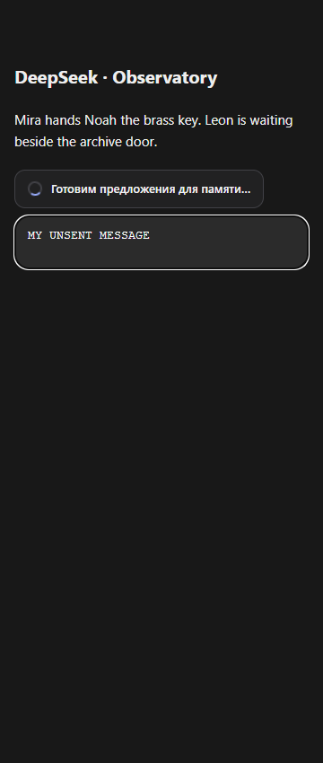
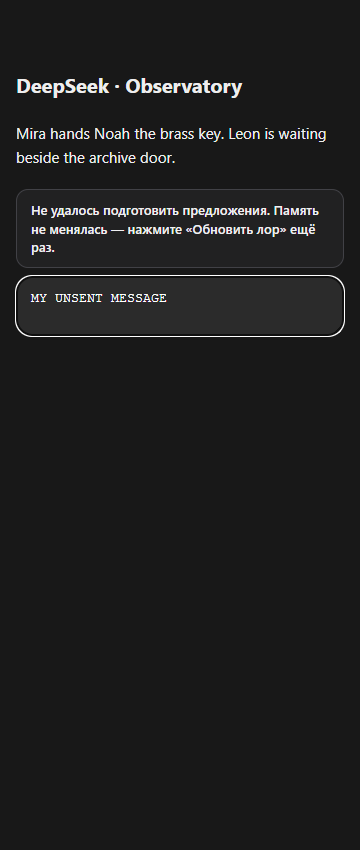
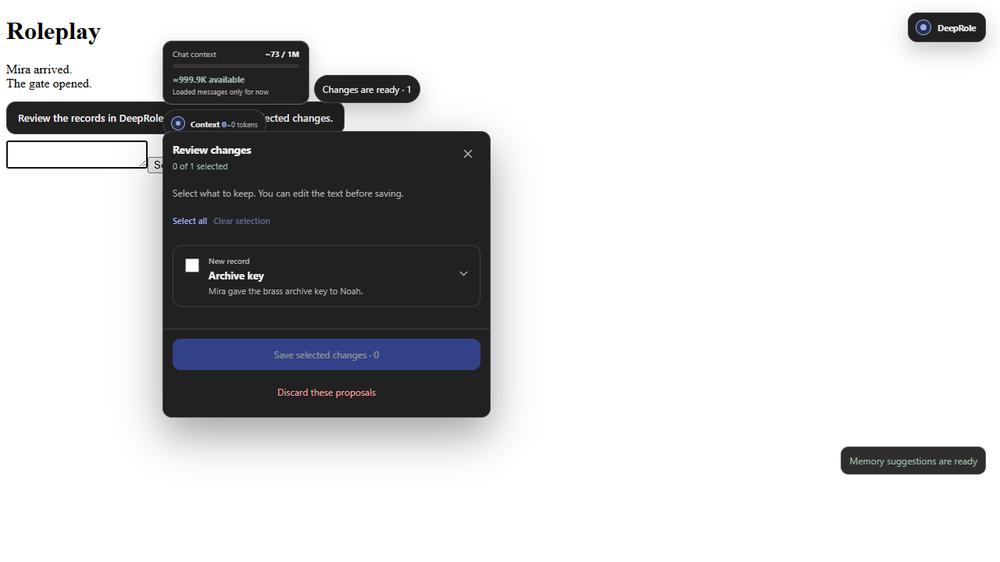

# Исправление вариантов и анализа памяти

В вашей истории DeepSeek уже подготовил пять предложений. Ошибка была в обработке длинного ответа: расширение принимало отдельные абзацы за разные сообщения. Из-за этого JSON не доходил до проверки, а плашки ожидания дублировались.

## Что изменилось

- Сообщение определяется по разметке DeepSeek, а не по высоте. Несколько абзацев и отдельных span читаются вместе.
- «Обновить лор» оставляет одну плашку ожидания. Служебный запрос, размышления этого анализа и JSON скрыты; обычная история не скрывается.
- Ответ остаётся привязан к запросу, даже если DeepSeek убрал запрос из списка при прокрутке. Сохраняется только наблюдавшийся ключ ответа, без угадывания номера.
- Ошибки сети, неподходящий результат, отказ сохранения и истёкшее ожидание больше не должны оставлять бесконечную загрузку. Максимум ожидания — десять минут; эта защита не останавливает сам DeepSeek.
- Завершённый анализ не становится новой ролевой сценой. Варианты исходной сцены остаются актуальными, пока пользователь не отправил новый ход.
- Готовые варианты из истории отображаются и при «Без мира», если включены в настройках. Выбор только заполняет поле сообщения. Новые запросы вариантов и синхронизация персонажей по-прежнему требуют подключённого мира; обычным чатам ничего не навязывается.

Предложения ещё не лор: пользователь отмечает нужные записи и сохраняет их. Анкеты, личные изображения и уже одобренные факты в этой проверке не редактировались.

## Проверка и ограничения

Разметка личной истории проверена только чтением. JSON завершён и корректен, содержит пять элементов; исходный ответ имеет высоту около 2334 пикселей. Его текст не копировался в тесты или документацию. Новые сообщения в личной истории не отправлялись.

Локальные сценарии используют нейтральную историю об обсерватории. Проверены длинные ответы, удаление запроса при прокрутке, повторная отрисовка, старые дубли индикаторов, пустой результат, истечение времени, сохранность черновика и подтверждение памяти. Финальный прогон: **461 unit/integration и 415 браузерных сценариев прошли**, 49 ожидаемых MV3-пропусков в Firefox. Строгий TypeScript без ошибок. Русские и английские снимки в Chromium/Firefox просмотрены; новая плашка прошла автоматическую проверку WCAG AA. Полный npm audit не нашёл известных уязвимостей. После упаковки прошли ещё 11 ключевых сценариев настоящего production-расширения на макете, включая сохранение, отмену и перенос мира.

Сбой при «Без мира» воспроизведён на прежней сборке; длинный ответ проверен в живом чате и нейтральном макете. Проверка отказа записи предложений также включает отказ служебного хранилища: индикатор прекращает загрузку, следующий запуск остаётся ручным. Ошибки первых UI-проверок уточнены отдельно: старое ожидание видимости служебного текста и обращение к трём элементам как к одному не соответствовали новому поведению. Финальный прогон выполняется без пересборки во время тестов.

Перезагрузка установленной пользовательской копии не подтверждена. Страница управления расширениями Brave не доступна инструменту; сборка файлов сама по себе не обновляет уже работающий скрипт. После завершения сборки нужно нажать ↻ у DeepRole и обновить вкладку DeepSeek, не удаляя расширение и мир.

Если прежний запрос потерял служебную привязку при перезапуске расширения, нужен свежий запуск «Обновить лор». Исторический JSON не применяется наугад к выбранному сейчас миру. Перед запуском проверьте мир в переключателе: на одном из снимков стоит «Без мира».

Chrome/Firefox и три ZIP обновлены, состав и каждый файл сверены по SHA-256. Полный локальный снимок с тестами — `private-assets/deeprole-checkpoint-20261003-memory-sync.zip`. Исходная версия `2cdfd33` и снимок портретов сохранены. Новая публикация не выполнялась.

## Снимки проверки

Нейтральный макет, не личная история и не доказательство перезагрузки пользовательской копии:

