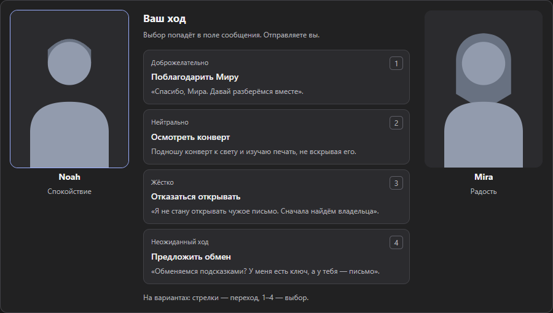
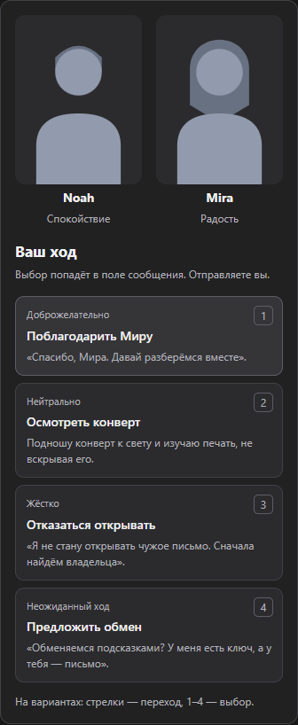

# Проверка продолжения истории и экрана сцены

3 октября 2026 года. Второй раунд после [первого аудита](QA-2026-10-03.md). Исправлена передача анкет в первое сообщение нового чата; экран действий стал ближе к визуальной новелле. Личный лор, портреты и переписки не изменялись. Работа сохраняется локально в ветке `codex/qa-20261003`; новая публикация на GitHub не выполнялась.

## Что исправлено и добавлено

- **Анкеты при продолжении истории.** Раньше в первом сообщении нового чата передавался пересказ, но могла отсутствовать отредактированная анкета героя. Теперь передаются и факты анкеты. Если сайт уже указал новый чат в отправленном запросе, состояние персонажей может обновиться с первого ответа. Если адресат неизвестен, модель получает только справочные сведения: ответ не записывается наугад в другой чат.
- **Разделение чатов.** Проверено сохранение выбранного мира, книги и героев при переносе и после перезагрузки. Ручные включения записей остаются в старом чате. Запрос, направленный в другой чат, не получает память открытого чата. Пересказ используется один раз; исходный лор не переписывается.
- **Экран «Ваш ход».** Крупные портреты 3:4, графитовые карточки и синий акцент выбранного действия. На широком экране герои по сторонам, на узком — над действиями. При наведении виден полный текст действия. Подпись явно говорит, что выбор находится в поле сообщения; автоматической отправки нет.
- **Клавиатура без помех.** Стрелки и 1–4 работают только на кнопках вариантов. Набор сообщения не перехватывается. Свой черновик не заменяется; при отказе вставить вариант блок прямо сообщает, что ваш текст сохранён. Успешная подпись описывает выполненную вставку, а не обещает, что текст останется неизменным после ручной правки. Во время ответа старые варианты не предлагают новый ход.

## Проверки

397 unit/integration-тестов прошли; TypeScript, проверка неиспользуемого кода и полный `npm audit` — без ошибок, уязвимостей не найдено. Покрытие проверяемых модулей `core` и `storage`: 89,56% инструкций, 83,65% ветвлений, 94,70% строк. Это не покрытие всего интерфейса.

Отдельно прошли 40 проверок персонажей и вариантов в Chromium/Firefox: RU/EN, ширина 320, 360, 760, 900 и 1280 px, пропорции, загрузка портрета, редактирование, черновик, клавиатура и автоматические проверки доступности WCAG AA. Автоматическая проверка не заменяет полноценный аудит доступности.

Полный прогон: **275 E2E прошли без ошибок**, 39 сценариев production-MV3 ожидаемо пропущены в Firefox. Общие адаптеры и интерфейс проверены в обоих браузерах, установленный MV3 — отдельно в Chromium. Проверены импорт, карта, подтверждение памяти, смена миров, сейф, восстановление вариантов, одновременные запросы и перенос пересказа до 30 000 символов. Пересказ не является копией всей переписки.

После финального уточнения обратной связи при занятом черновике заново прошли 397 проверок логики и 10 сценариев вариантов в обоих браузерах. Проверяется не только сохранность текста, но и сообщение об отказе вставить действие.

## Что удалось проверить на настоящем DeepSeek

В отдельном нейтральном чате «Детективная сцена» модель продолжила историю взрослых Ноя и Миры, затем вернула четыре корректных предложения по кнопке обновления лора. Запущенная пользовательская копия расширения показала ошибку вместо списка. Исправленный разбор такого ответа проверен в локальной production-сборке; это не доказывает, что пользовательская копия уже обновлена.

Страница управления расширениями Brave недоступна инструменту. Перезагрузка установленной копии и живое подтверждение предложений не выполнены. Предложения не принимались, новые записи в личную библиотеку не добавлялись. Живой тест сохранён отдельно от репозитория; ограничения управления не обходились.

## Проверенный вид сцены

Нейтральные данные тестовой страницы, не скриншоты личной игры. Оба снимка просмотрены после полного прогона соответствующих сценариев.

Раскладка опирается на [Lazyweb / responsive-design](https://raw.githubusercontent.com/wshobson/agents/main/plugins/ui-design/skills/responsive-design/SKILL.md): размер контейнера вместо предположения о размере монитора, проверка промежуточных ширин и достаточно крупные действия.

## Следующий раунд

Chrome/Firefox и три ZIP в `downloads` пересобраны; состав проверен, личных данных и тестовых профилей нет. Доступ остался только к DeepSeek. После пересборки повторно прошли пять ключевых сценариев переноса и разбора служебных ответов. Архив исходников содержит отчёт и два нейтральных снимка; полный набор тестов находится в репозитории.

Подтвердить обновлённую установленную копию на живом сайте. Затем — очень большие JSON, совместимость с Better DeepSeek, карта на низком экране и избыточная высота управления сценой в split-screen. Предупреждение сборщика о крупных JS-файлах остаётся; разбиение загрузки в этом раунде не выполнено.
