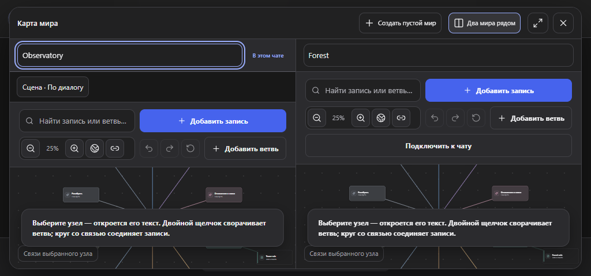
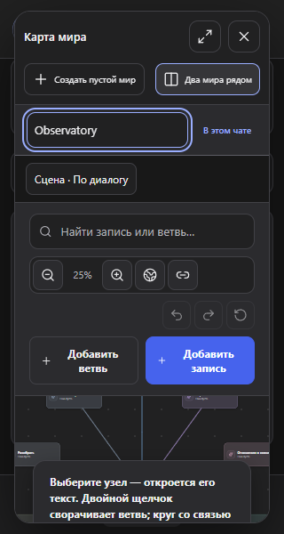
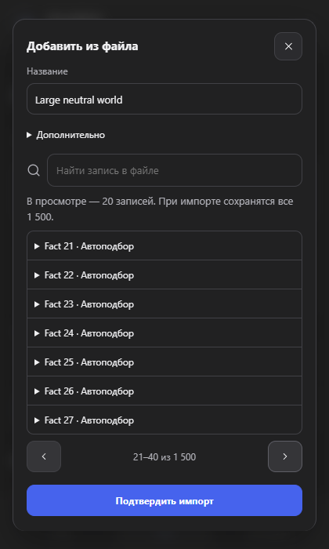

# Проверка DeepRole 3 октября раунд 3

В этом раунде проверены карта, два мира рядом и импорт больших файлов. Исправлены подмена выбранного файла старым результатом, разрастание настроек сцены и пересечение кнопок на узком экране. Личный лор не изменён. Работа сохранена локально в `codex/qa-20261003`; новая публикация на GitHub не выполнялась.

## Что изменилось

- Настройки сцены открываются поверх карты, а не сжимают дерево. Escape закрывает настройки и возвращает фокус на кнопку. Клик вне них тоже закрывает окно. Убрано старое правило, растягивавшее узкую карту до 800 пикселей при открытии настроек.
- «Два мира рядом» заменило английскую подпись Splitscreen Edit. Отметка «В этом чате» показывает подключённый мир, независимо от того, какую карту вы редактируете. Текст объяснения сцены короче; её выбор не переписывает лор и не отправляет сообщение.
- В низком окне кнопки занимают меньше строк. В очень узком окне масштаб и отмена действий разделены, поэтому не налезают друг на друга. Кнопки не скрыты и не уменьшены.
- Предпросмотр файла показывает по 20 записей. Поиск ищет по названию, тексту и ключам; есть перелистывание. Явная подпись объясняет, что импорт сохранит весь файл, даже если поиск показывает одну запись.
- Если новый файл прочитан быстрее старого, остаётся новый. Более поздний ошибочный файл не подменяется старым правильным. Во время сохранения нельзя закрыть импорт, повторно подтвердить его или заменить файл перетаскиванием.

## Что проверено

399 unit/integration прошли, проверка типов и полный npm audit без ошибок. Покрытие выбранной области логики и хранилища — 94,7% строк, не всего интерфейса.

Полный браузерный прогон: **305 прошли, 39 ожидаемо пропущены в Firefox**. Пропуски касаются установленного Chrome MV3; общий интерфейс и адаптеры проверены в обоих браузерах. Проверены память с подтверждением и отменой, анкеты, эмоции, варианты действий, разные чаты, перенос истории, сейф, импорт и карта. Это не гарантия отсутствия всех ошибок на меняющемся сайте DeepSeek.

После просмотра снимков добавлена проверка пересечения самих кнопок, а не только их контейнеров. Она воспроизвела проблему при ширине 320 пикселей. После финальной правки повторно прошли **48 сценариев интерфейса** в Chromium и Firefox: RU/EN, ширины 320/420/760/1024 и высота до 480 пикселей, клавиатура, геометрия карточек и автоматические проверки доступности. Автоматическая проверка не заменяет полноценный аудит доступности.

Импорт 1 500 записей сохраняет их все, включая последнюю выключенную ручную запись с исходным текстом и ключами. Логические тесты отдельно проверяют границу 10 000 записей для JSON и BDS и отказ на 10 001 без частичного импорта. Production-MV3 на нейтральном макете подтверждает: редактирование соседней карты не подмешивает её память в чат; отметка подключённого мира меняется только вместе с реальным подключением.

## Снимки

Нейтральные тестовые данные, не личная история. Снимки просмотрены после проверок.

Рекомендации [Lazyweb responsive-design](https://raw.githubusercontent.com/wshobson/agents/main/plugins/ui-design/skills/responsive-design/SKILL.md) использованы для раскладки по размеру контейнера и проверки промежуточных размеров. Применены testing-qa, i18n-localization и ux-copy; живое состояние проверено через computer-use, отчёт подготовлен с write-page.

## Что осталось

Chrome/Firefox и три ZIP пересобраны. Проверены чтение архивов, состав без личных файлов и тестовых профилей, разрешения только для DeepSeek. После упаковки заново прошли шесть ключевых сценариев разбора ответов, переноса истории и изоляции миров. Полные тесты сохранены в репозитории; установочные архивы их не содержат.

В нейтральном живом чате «Детективная сцена» перепроверено состояние после обновления страницы. Перезагрузка установленного DeepRole в Brave не подтверждена: страница управления расширениями недоступна инструменту. Новые сообщения в этом раунде не отправлялись, предложения не принимались. Успешные проверки production-сборки на макете не означают, что пользовательская копия уже обновлена.

Дальше — подтверждение обновлённой копии на живом сайте, совместимость с Better DeepSeek и разделение крупных JS-файлов. Предупреждение сборщика остаётся: примерно 830 кБ для меню и 570 кБ для кода страницы. Готовые сборки и ZIP хранятся в `downloads`; установленное расширение обновляется отдельно.
