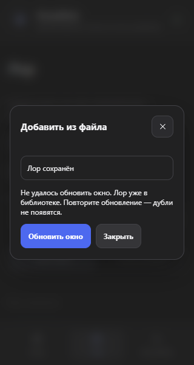
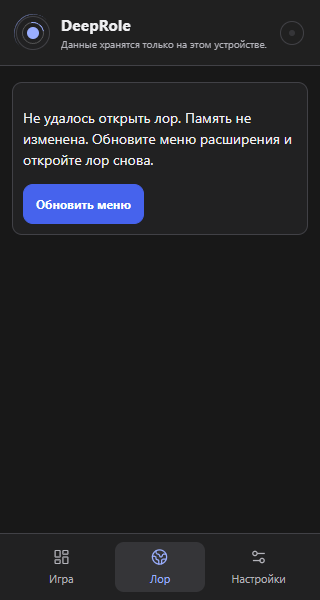

# Проверка DeepRole 3 октября раунд 4

Исправлен подтверждённый сбой импорта: память уже сохранялась, но ошибка обновления окна предлагала импортировать её заново. Повторное нажатие создавало дубли. Теперь повторяется только обновление окна. Личный лор не изменён; работа сохраняется локально, без новой публикации.

## Что изменилось

- После успешной записи появляется «Лор сохранён». При сбое окна есть «Обновить окно» и «Закрыть»; повторного создания мира, книги и записей нет.
- Во время сохранения название, мир назначения и подключение к чату заблокированы. Раньше их можно было менять, хотя сохранялся прежний выбор; проблема воспроизведена отдельным тестом.
- Тяжёлая карта загружается при открытии «Лора». Начальный JS-файл меню уменьшился с 830 321 до 674 945 байт, примерно на 19%. Это размер файла, не измерение скорости на вашем ПК. Суммарный размер всех частей не уменьшился; основной скрипт страницы пока не уменьшен, предупреждение о крупных файлах не скрыто.
- Если часть меню не загрузилась, вместо пустого экрана есть объяснение и «Обновить меню». Память остаётся на месте, другие разделы доступны. Проверка отказа выявила разное поведение повторной загрузки в Chromium и Firefox; действие явно обновляет меню, а не обещает повторить неработающий импорт модуля.
- По снимку исправлено просвечивание текста страницы во время появления окна импорта: убрана прозрачная фаза анимации, окно читается сразу. Главное действие восстановления выделено синим. Это визуальная доработка, не ошибка сохранения памяти.

## Проверки

405 логических тестов прошли. Проверка типов с поиском неиспользуемого кода и полный npm audit — без ошибок. Покрытие выбранной области логики и хранилища: 94,7% строк, не всего интерфейса.

18 браузерных проверок восстановления импорта прошли в Chromium и Firefox: русский и английский, JSON, BDS, пакет мира, существующий мир, два последовательных сбоя обновления, отказ записи и закрытие после сохранения. Новые ошибки объявляются для вспомогательных технологий; снимки на ширине 320 пикселей просмотрены.

Шесть проверок цепочек fetch/XHR подтверждают сохранность памяти двух перехватчиков, заголовков, параметров запроса и исходного потока ответа. Проверены оба порядка установки и отсутствие двойной отправки. Это моделирование механизма соседнего расширения, не полная проверка настоящего Better DeepSeek. Перехватчик, который удаляет чужие данные или переписывает формат, требует отдельной проверки.

Chrome/Firefox и три ZIP пересобраны. Все файлы установочных архивов сверены с текущими сборками по SHA-256, проверены состав и доступ только к DeepSeek. После упаковки прошли 6 ключевых сценариев production-расширения на нейтральном макете: импорт/подключение RU/EN, плавающая карта, независимые панели и два варианта переноса истории. Ветка и архивы сохранены локально; новая публикация на GitHub не выполнялась. Установочный `sources` не содержит тестов; полный Git-снимок с тестами сохранён в `private-assets`.

Окончательный полный браузерный прогон: 331 прошли без ошибок; 39 ожидаемых пропусков MV3-сценариев в Firefox. После последней визуальной доработки дополнительно прошли 50 сценариев импорта, восстановления, загрузки лора и карты в обоих браузерах. Снимки просмотрены; окно импорта больше не смешивает свой текст с фоном. Проверка типов повторно прошла.

В первых прогонах исправлены ошибки самих проверок: неверный селектор доступности, адрес модуля с параметрами обновления, преждевременный повтор запроса после записи в session storage и требование абсолютно одинаковых дробных координат окна в Firefox. Теперь готовность определяется состоянием видимых действий, а допуск положения меньше 0,05 пикселя. Два последних сценария прошли пять повторов подряд (15 успешных проверок и 5 ожидаемых Firefox-пропусков), затем весь набор прошёл целиком. Требования к сохранению, защите черновика и отсутствию двойной отправки не ослаблены.

## Живой DeepSeek и ограничения

Прочитан сохранённый нейтральный чат «Детективная сцена». В нём остаются четыре предложения предыдущего раунда; новых сообщений и сохранений в этом раунде не было. Управление меню Brave ограничено инструментом; подтвердить перезагрузку установленного расширения не удалось. Работа собранного расширения на макете проверяется отдельно и не выдаётся за живую проверку пользовательской копии.

Следующие проверки: реальный Better DeepSeek, подтверждение версии в живом браузере и дальнейшее разделение крупных файлов без риска для инъекции. Тестовые записи пользователя не удалены.

## Нейтральные снимки

Это тестовая история с искусственно вызванными сбоями, не личный лор и не снимки установленной копии пользователя.

Для пояснений применена рекомендация Lazyweb [Impeccable clarify](https://raw.githubusercontent.com/pbakaus/impeccable/main/.claude/skills/impeccable/reference/clarify.md): отделять результат от ошибки и называть конкретное действие восстановления. Проверки — testing-qa; короткие сообщения — ux-copy; RU/EN — i18n-localization; оформление отчёта — write-page.
