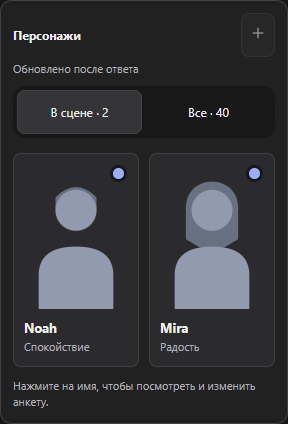
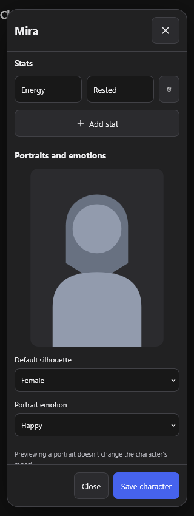
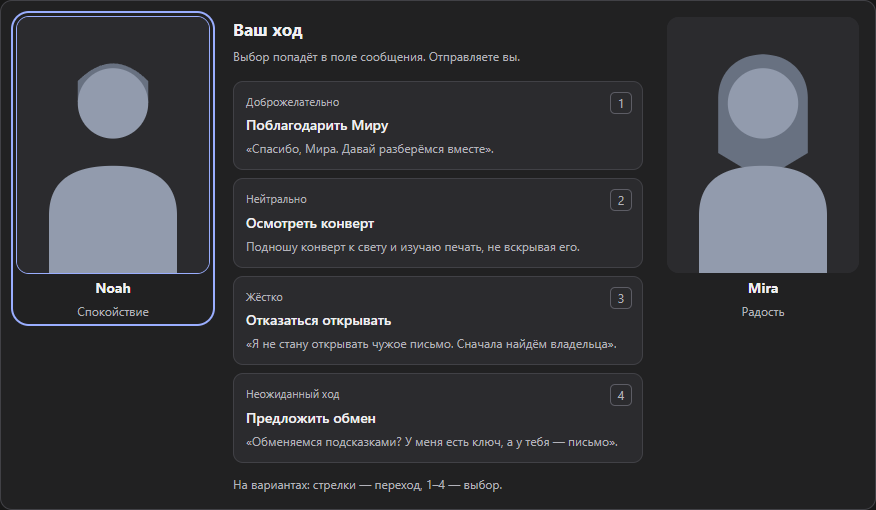

# Проверка персонажей и портретов 3 октября

Персонажи стали удобнее для игры: сначала видны герой и текущие участники, а не вся библиотека. Исправлены потеря фокуса при обновлении портрета и после закрытия анкеты, лишнее подтверждение при просмотре эмоций и пустые карточки при повреждённой картинке. Личный лор и загруженные изображения не изменены.

## Что изменилось

| Было | Теперь | Зачем |
| --- | --- | --- |
| Все персонажи в одной длинной сетке | «В сцене» и «Все» с поиском по имени или псевдониму | Участники рядом, остальная библиотека доступна одним нажатием |
| При смене эмоции портрет создавался заново | Меняются картинка и подпись, сама кнопка остаётся | Фокус клавиатуры не теряется |
| После анкеты фокус возвращался на контейнер | Возвращается на нажатый портрет, включая вложенный интерфейс вариантов | Можно продолжить игру с клавиатуры |
| Просмотр эмоций и неудачная загрузка считались правкой | Предпросмотр и отклонённый файл не требуют сохранения; настроение редактируется отдельно | Нет лишнего вопроса при закрытии |
| Повреждённая картинка оставляла пустой портрет | Обычный портрет, затем силуэт, без бесконечных повторов | Экран остаётся пригодным для игры; сохранённые картинки не удаляются |

Если участников ещё не определили, показываются все с пояснением. Герой остаётся в режиме «В сцене». Переключение фильтра не меняет память и отправляемый контекст; при переходе в другой чат или мир поиск очищается. Редактор открывает предпросмотр текущего настроения, а не всегда спокойного портрета.

Повторная проверка неизменившихся портретов не меняет их элементы. Кэш источников хранится в памяти, без повторной упаковки картинки в JSON и дублирования её байтов в служебном атрибуте. Это устранение лишних операций, не измеренное ускорение на пользовательском ПК.

## Проверки

410 логических тестов прошли. Проверка типов с поиском неиспользуемого кода и npm audit — без ошибок. Покрытие выбранной области логики и хранения: 94,72% строк; это не процент всего интерфейса.

46 проверок персонажей прошли в Chromium и Firefox: русский и английский, ширины 320–1280 пикселей, 1 и 40 персонажей, поиск, смена области, сохранность настоящей правки, клавиатура, автоматическая доступность и повреждённые изображения. Снимки просмотрены. Потеря фокуса при смене эмоции воспроизведена тестом до исправления. Браузерная проверка выявила второй сброс после закрытия анкеты; он исправлен и повторно проверен.

Полный повторный прогон: 348 браузерных сценариев прошли без ошибок, 40 ожидаемо пропущены в Firefox — они требуют установленного Chrome MV3. Проверены также импорт, карта, выбор памяти, отказ запроса, новый чат, перенос мира и пересказа.

Chrome/Firefox и три ZIP пересобраны. Каждый файл установочных архивов сверён с текущей сборкой по SHA-256; проверены состав, безопасные пути и доступ только к DeepSeek. Исходники сверены с рабочими файлами и не содержат личных данных или тестовых профилей. После упаковки отдельно прошли семь production-сценариев: импорт RU/EN, плавающая карта, раздельное редактирование миров, персонажи и два варианта переноса в новый чат. Это установка в нейтральный тестовый профиль, не проверка пользовательского Brave. Готовые архивы — в `downloads`, полный Git-снимок с тестами — `private-assets/deeprole-checkpoint-20261003-round5.zip`.

Новый сценарий установленного production-расширения прошёл пять раз подряд: библиотека из 40 персонажей, два участника сцены, поиск по псевдониму, предпросмотр без правки, сохранение настроения, фокус, исходящий запрос без картинки, другой чат и возврат с перезагрузкой. Пять Firefox-пропусков ожидаемы: этот сценарий устанавливает Chrome MV3, общий интерфейс отдельно проверен в Firefox. Первый полный прогон выявил возврат фокуса между разными изолированными блоками страницы; отдельный тест компонента подтверждает причину до исправления. Отклонённая загрузка также воспроизведена отдельным тестом до исправления.

## Живой сайт и ограничения

Прочитан отдельный нейтральный чат DeepSeek «Детективная сцена», затем обновлена его страница. Brave сообщает, что открытый интерфейс другого расширения блокирует автоматизацию. Новых сообщений, подтверждений памяти и изменений личных чатов в этом раунде не было. Перезагрузка установленной пользовательской копии не подтверждена; отдельный тестовый профиль с production-расширением не выдаётся за эту проверку.

Настоящий Better DeepSeek и дальнейшее уменьшение крупных JS-файлов остаются отдельными задачами. Предупреждение сборщика о крупных файлах не скрыто. Изменения сохраняются локально; новой публикации на GitHub нет.

## Нейтральные снимки

Это тестовые персонажи и локальные проверки, не личная история.

Использованы testing-qa, ux-copy, i18n-localization и write-page. Через Lazyweb прочитана [Emil design engineering](https://raw.githubusercontent.com/emilkowalski/skills/main/skills/emil-design-eng/SKILL.md): частые игровые действия отвечают сразу, без декоративных задержек; стандартные состояния и фокус важнее анимации. Убрано неиспользуемое правило перехода прозрачности портрета, новые зависимости для анимации не добавлены.
