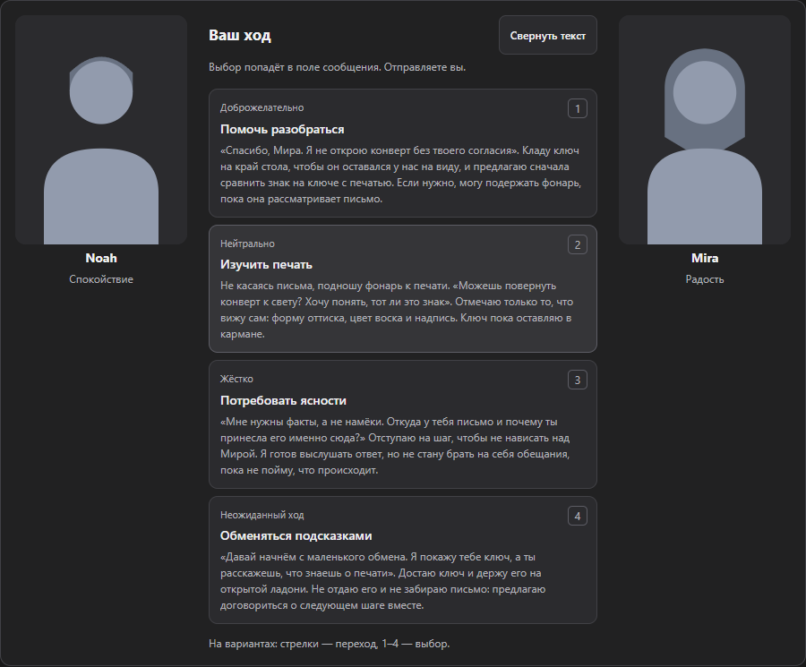

# Проверка вариантов ответа 3 октября

Игровой экран стал понятнее: длинную реплику можно прочитать до выбора, а стрелки идут по расположению кнопок. Исправлен выбор устаревшего хода в коротком промежутке между новой репликой и обновлением интерфейса. Личные чаты, лор и изображения не менялись.

## Что изменилось

| Было | Теперь | Зачем |
| --- | --- | --- |
| Длинный ход обрезан; полный текст только при наведении | «Текст целиком» раскрывает реплики внутри карточки | Читать удобно и без мыши; просмотр ничего не отправляет |
| «Вниз» в двух колонках переводит вправо | Стрелки учитывают реальную сетку, Home/End ведут к краям списка | Клавиатура ведёт себя ожидаемо даже после изменения ширины |
| Старую карточку можно нажать до следующего обновления | Последний ответ и адрес чата проверяются в момент выбора | Ход из прежней сцены не попадает в черновик |
| Обновление действия не обновляло сохранённую карточку | Кнопки получают новое поведение; карточка остаётся на месте | Раскрытый текст и фокус не пропадают |
| Незавершённая вставка отключает кнопки | Фокусируемые кнопки с состоянием ожидания и защитой от повторного выбора | Управление остаётся предсказуемым; ошибка освобождает ожидание |

Крупные портреты 3:4 сохранены. Просмотр текста не тратит модельные токены и не создаёт запросов, событий или записей памяти. Выбранную реплику по-прежнему отправляет пользователь. Свой или отредактированный текст не заменяется.

## Проверки

416 логических тестов прошли; TypeScript с проверкой неиспользуемого кода — без ошибок. Покрытие выбранной области логики и хранения — 94,72% строк, не всего интерфейса.

68 проверок персонажей и вариантов прошли в Chromium и Firefox: русский/английский, узкие экраны, поиск, анкеты, защита черновика, полный текст, клавиатура, доступность и портреты. Снимки просмотрены. HTML-подобный текст модели отображается как обычный текст, не исполняется.

Пять повторов нового сценария установленной production-сборки прошли: полный текст, клавиатура, редактирование черновика, нажатие старой карточки до обновления, новый чат и возвращение с восстановлением вариантов. Скрытых отправок или записей в лор нет.

До исправления два логических теста подтвердили устаревший выбор и прежний обработчик; отдельная проверка ожидания показала отключение кнопок. Стрелка «вниз» воспроизведена в обоих браузерах до исправления. Первоначальное предположение о потере фокуса при обычном отказе не подтвердилось: этот сценарий уже проходил до правки. Сбои счётчиков кнопок после добавления нового действия были исправлены уточнением проверки четырёх вариантов, не удалением тестов.

Полный прогон: **363 браузерных сценария прошли без ошибок**, 41 ожидаемо пропущен в Firefox — они требуют Chrome MV3. Проверены импорт, карта, память, сейф, переходы между чатами, перенос пересказа и интерфейс RU/EN. TypeScript повторно проверен после последнего теста; npm audit не нашёл уязвимостей.

Chrome/Firefox и три ZIP пересобраны. Каждый файл архивов сверён со своей текущей сборкой или исходником по SHA-256; состав, доступ только к DeepSeek и отсутствие личных данных проверены. После упаковки прошли **8 ключевых сценариев установленного расширения** на нейтральном макете: импорт RU/EN, плавающая карта, разделённое редактирование миров, персонажи, выбор действия и два варианта переноса в новый чат.

Готовые архивы — в [downloads](../downloads/README.md). Работа сохранена локально в `codex/qa-20261003`; полный Git-снимок с тестами — `private-assets/deeprole-checkpoint-20261003-round6.zip`. Предыдущие контрольные копии сохранены. Установочные ZIP не включают тесты; для продолжения разработки нужен полный снимок.

## Живой браузер и границы проверки

Управление нейтральным чатом DeepSeek «Детективная сцена» остановлено Brave: открыт интерфейс другого расширения. В этом раунде новых живых сообщений и сохранений памяти не было. Перезагрузка установленной пользовательской копии не подтверждена; нейтральный профиль с production-расширением не выдаётся за проверку личного браузера.

Проверка настоящего Better DeepSeek и дальнейшее разделение крупных JS-файлов остаются отдельными задачами. Предупреждение о размере сборки не скрывается. Новая публикация на GitHub не выполнялась.

## Нейтральные снимки

Это локальная тестовая сцена, не пользовательская история.

Использованы testing-qa, ux-copy, i18n-localization и write-page. Через Lazyweb прочитана [Emil design engineering](https://raw.githubusercontent.com/emilkowalski/skills/main/skills/emil-design-eng/SKILL.md): частые действия отвечают сразу, без декоративной анимации; фокус, стандартные состояния и ясные действия важнее украшений. Новые зависимости и разрешения не добавлены.
