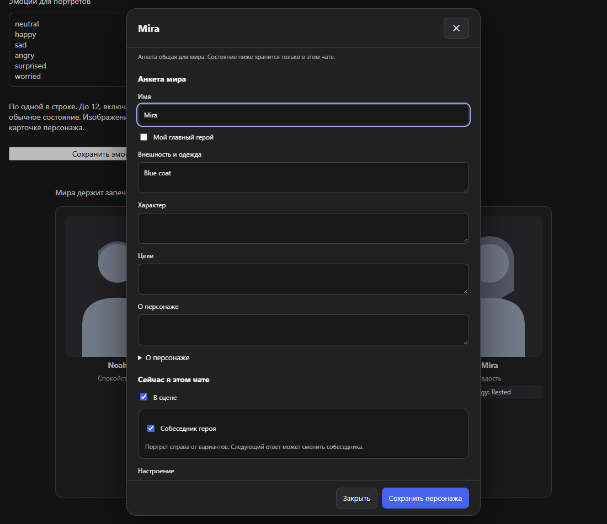

# Финальная проверка · 3 октября

Можно вручную выбрать собеседника для правого портрета. Исправлено ложное предупреждение о другом мире после ручной правки персонажа и возвращения в чат. Личный лор, портреты и прежние чаты не менялись.

## Что изменилось

| Было | Теперь | Зачем |
| --- | --- | --- |
| Неверного собеседника справа нельзя поправить в анкете | Открыть персонажа → «Собеседник героя» → сохранить | Исправить сцену самому, не просить модель о новом ответе |
| После ручной правки терялась отметка уже учтённого ответа | Отметка сохраняется вместе с новой версией сцены | При возвращении нет ложного конфликта; старый ответ не отменяет вашу правку |
| Уход собеседника мог переключить портрет на другого присутствующего | Справа становится пусто до следующего выбора или ответа | Присутствовать рядом — не значит разговаривать с героем |

Переключатель находится в разделе **«Сейчас в этом чате»**, не спрятан в меню. Пояснение видно сразу; область нажатия — минимум 44 px. Выбор добавляет персонажа в сцену и действует только после сохранения. Ошибка сохраняет черновик. Главный герой не выбирается своим собеседником. Следующий ответ может сменить партнёра: это не постоянное закрепление. Чужие чаты и общие анкеты остальных персонажей не изменяются.

Крупные портреты 3:4 и показатели сохранены. Новых фоновых запросов, дополнительных инструкций, зависимостей и разрешений нет. Состав передаваемых анкет по-прежнему зависит от участников сцены; их текст расходует токены. Обычный лор сохраняется с подтверждением. Защита от запоздалых и чужих ответов не отключена.

## Проверки

437 логических тестов прошли. Строгая проверка TypeScript с поиском неиспользуемого кода — без ошибок; полный npm audit не нашёл уязвимостей. Покрытие выбранной области core/storage — 94,70% строк, не всего интерфейса.

Новый установленный production-сценарий прошёл пять раз подряд: ручной выбор отсутствующего персонажа, правый портрет, сохранение после перезагрузки, отсутствие повторного применения прежнего ответа, смена собеседника новым ответом, переход в другой чат и обратно. Только два предусмотренных исходящих запроса; ручной выбор ничего не отправляет. Обычный лор и общие анкеты сохранены.

Интерфейс проверен на русском и английском, при ширине 320 и 1100 px: клавиатура, отсутствие горизонтального скролла, WCAG AA-скан, ошибка сохранения, смена главного героя, присутствие и понятная подпись. Восемь новых UI-сценариев прошли в Chromium и Firefox. Свежие нейтральные снимки просмотрены. До исправления отдельный логический тест воспроизвёл потерю отметки ответа. Ошибки слишком широкого локатора в тесте исправлены отдельно, не выдаются за баг приложения.

Полный прогон: **385 браузерных сценариев прошли без ошибок**, 43 ожидаемо пропущены в Firefox — им нужна Chrome MV3. В том числе проверены импорт, память, карта, сейф, резервные копии, обычные чаты и перенос истории. Перенос сохраняет мир, книгу, выбранных героев и пересказ до 30 000 символов, но не всю переписку и не настройки памяти отдельного чата.

Chrome/Firefox и три ZIP пересобраны; каждый файл архивов сверён со сборкой или исходником по SHA-256. Состав и DeepSeek-only доступ проверены; личные данные исключены. После упаковки прошли **10 ключевых сценариев установленного production-расширения** на нейтральном макете: импорт RU/EN, плавающая карта, разделённое редактирование, персонажи и ручной выбор собеседника, показатели, варианты и два вида переноса.

Архивы — в [downloads](../downloads/README.md). Работа сохранена локально в `codex/qa-20261003`, полный снимок с тестами — `private-assets/deeprole-checkpoint-20261003-round8.zip`. Предыдущие семь контрольных копий сохранены. Установочный `sources` не содержит тестов: для разработки используйте полный снимок или эту ветку.

## Живой DeepSeek

Во встроенном браузере создан отдельный нейтральный чат «Проверка сцены», без подключения личного мира. Отправлены две реплики: сначала разговор с Мирой, затем её уход и появление Леона. Модель вернула по четыре действия и корректный блок состояния: присутствуют Ной и Леон, собеседник — Леон, настроение — тревога, отсутствующая Мира не добавлена в сцену. Блок принят настоящим парсером проекта; без принятой локальной метки запроса он не может быть привязан к миру. Ответ сохранился после перезагрузки страницы без новой реплики. Это проверка поведения модели по явным инструкциям, не доказательство автоматического сохранения памяти расширением. Тестовые ответы просмотрены; никаких записей в личный мир не добавлялось.

Меню DeepRole во встроенном браузере открывается пустым для инструмента; Brave блокирует управление из-за открытого интерфейса другого расширения. Обход ограничений, переустановка с потерей данных и запись в личную библиотеку не выполнялись. Перезагрузка установленной пользовательской копии пока не подтверждена. Настоящий Better DeepSeek и дальнейшее разделение больших JS-файлов остаются отдельными задачами; предупреждение размера сборки не скрыто. Публикации на GitHub в этом раунде нет.

## Снимки

Нейтральный макет, не личная история.

[Узкое окно](screenshots/qa-2026-10-03-round8/interlocutor-narrow.png) · [English в Firefox](screenshots/qa-2026-10-03-round8/interlocutor-en-firefox.png)

Использованы testing-qa, ux-copy, i18n-localization и write-page. Через Lazyweb прочитана [Emil design engineering](https://raw.githubusercontent.com/emilkowalski/skills/main/skills/emil-design-eng/SKILL.md): видимое объяснение, общий ритм отступов, сохранение фокуса и мгновенные частые действия без лишней анимации.
