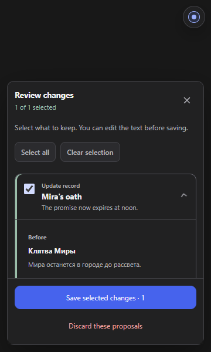
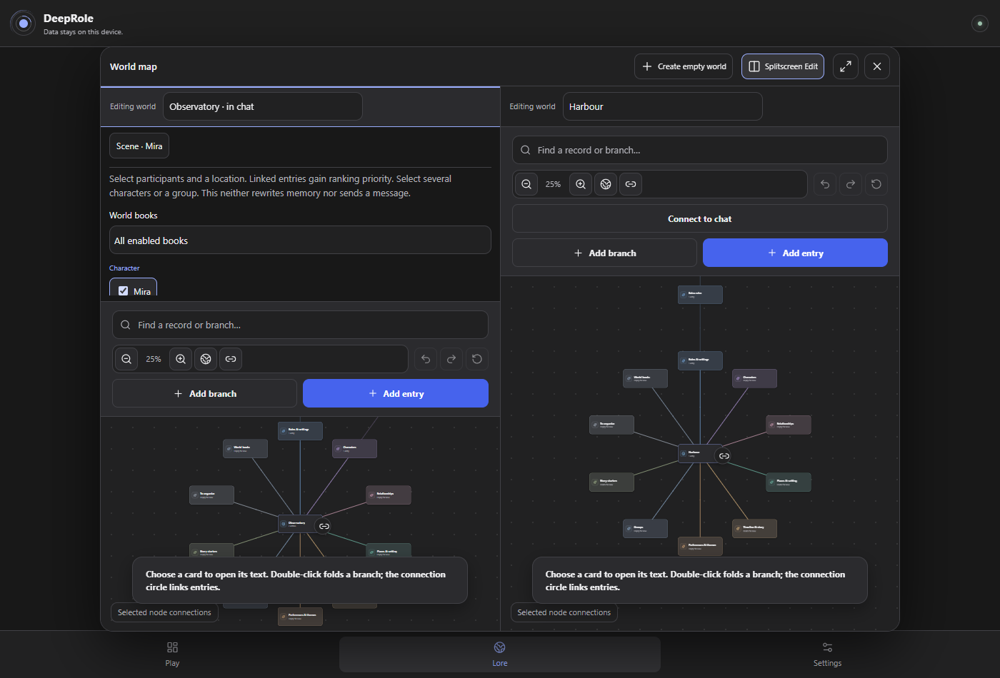

# DeepRole · проверка 3 октября 2026

Первый раунд: синхронизация с DeepSeek, память, персонажи, карта и перенос истории. Исходная версия сохранена отдельным коммитом `70d6cce` и локальным архивом. Работа идёт в `codex/qa-20261003`; личный лор не менялся и в архивы не включён.

## Что ломалось и исправлено

| Было | Теперь |
| --- | --- |
| DeepSeek выдавал предложения, но DeepRole сообщал об ошибке. На живом сайте начало блока, JSON и конец оказались в разных элементах страницы. | Разбирается целый блок из окончательного ответа. Объяснение модели остаётся видимым; сохранение — только после выбора пользователем. |
| Служебный пример из размышлений мог подменить настоящий результат. | Размышления исключены из разбора предложений и пересказа. Проверены оба формата и повторное появление старого ответа. |
| Одинаковые псевдонимы двух других персонажей блокировали обновление всей сцены. Два имени одного персонажа могли молча перезаписать одно состояние другим. | Неоднозначность проверяется только для упомянутого имени. Конфликтующие обновления одного персонажа отклоняются целиком, без частичной записи. |
| Меню само открывалось при входе, закрывало кнопку; Escape с основной страницы не закрывал обычное меню. | Меню открывается по запросу. Escape закрывает меню или карту, не отправляет сообщение. |
| Окошко карты перекрывало выбранную карточку и мешало двойному клику; высокие портреты выталкивали «Сохранить» за экран. | Карточка остаётся доступна для клика. Проверка памяти ограничена размером экрана, действия доступны при прокрутке. Панель карты компактнее на узких экранах. |
| Быстро открытое окно импорта могло смещаться из-за анимации родительского раздела. | Анимация раздела отключается, пока открыто отдельное окно. Центрирование не зависит от момента клика. |

Убраны 18 замечаний о неиспользуемом коде; TypeScript теперь запрещает новые неиспользуемые переменные и параметры. Это не заявление, что все возможные неиспользуемые экспорты проекта найдены.

## Что действительно проверено

- **395 unit/integration-тестов**, проверка типов и аудит зависимостей без ошибок; известных уязвимостей по `npm audit` — 0. Покрытие строк 94,67% относится только к настроенному набору `core/storage`, не ко всему приложению.
- Заключительный полный браузерный прогон: **262 прошли, 0 ошибок, 36 ожидаемых пропусков** Chrome MV3-runtime в Firefox, 8,2 минуты. Всего 298 сценариев.
- Проверены RU/EN, Chromium/Firefox, узкие экраны, портреты 3:4, загрузка эмоций, ручная правка, повторный вход, изоляция чатов/миров, split-screen, импорт/экспорт, сейф, отмена/ошибки, выбор предложений и undo. Проверки доступности автоматические, дополнены клавиатурой и проверкой геометрии; полного ручного WCAG-аудита нет.
- Перенос пересказа длиной **30 000 символов** проверен в самом исходящем запросе установленной production-сборки на макете сайта: без обрезки, с сохранённым снимком, однократно после принятия запроса. Старый чат не удаляется. Это пересказ, а не копирование всей переписки: полнота фактов зависит от DeepSeek. Превышение лимита отклоняется, а не тихо обрезается.
- Счётчик истории проверен на 1 000 длинных сообщений, разных форматах текста и неполной истории. В расширение возвращаются только счётчики, не текст переписки.

Исходный полный E2E-прогон дал **214 успешных, 36 ошибок, 34 пропуска**. Часть ошибок была в устаревших шагах тестов. Реальные сбои воспроизведены до исправления; трассы сохранены локально. Промежуточные прогоны не выдаются за зелёные. Два сбоя последнего промежуточного прогона оказались в макете/синхронизации теста: новый чат отправлял обычную HTML-форму вместо API-запроса, а клик по карте опережал перерасчёт iframe. После исправления оба сценария прошли по **5 раз**; импорт RU/EN — **20 повторных проверок** без ошибок.

## Живой DeepSeek — честное ограничение

Создан отдельный чат «Карта и ключ»: взрослые Ноа и Мира, башня, ключ и срок 18:30, без подключённого личного мира. DeepSeek ответил на сцену и подготовил четыре предложения по кнопке «Обновить лор». Именно здесь обнаружен сбой разбора раздельных элементов; исправление проверено регрессией с той же структурой страницы.

После открытия меню Brave инструмент управления браузером заблокировал дальнейшую автоматизацию из-за открытого интерфейса расширения. Обход не выполнялся. Поэтому **новая сборка ещё не подтверждена на живом аккаунте**, предложения в этом чате не приняты, перезагрузка пользовательской установленной копии не подтверждена. Личные чаты и сторонние расширения не удалялись. Все последующие браузерные проверки шли в отдельных невидимых тестовых профилях.

## Снимки после исправлений

Только искусственные данные; снимки просмотрены вручную.

Раскладка исправлена с опорой на [Lazyweb / responsive-design](https://raw.githubusercontent.com/wshobson/agents/main/plugins/ui-design/skills/responsive-design/SKILL.md): ограничения по размеру окна, контейнерные правила и проверка промежуточных размеров. Русские/английские подписи сохранены едиными.

## Что дальше

- Подтвердить новую установленную копию на живом DeepSeek, когда управление браузером снова доступно. Пересборка сама её не перезагружает.
- Следующий раунд: сложный перенос с миром и профилями, большие/нестандартные JSON, одновременные вкладки и совместимость с Better DeepSeek.
- Отдельный UX-раунд: карта на низком экране, выбор сцены, отнимающий высоту в split-screen, первый запуск и тексты. Сборщик предупреждает о крупных JS-файлах; разбиение загрузки пока не выполнено.

Обе production-сборки и три ZIP в `downloads` обновлены. Проверен состав: личных JSON, изображений и тестовых профилей нет; доступ расширения остаётся только к DeepSeek. Архив исходников содержит этот отчёт и два нейтральных снимка, но не тесты. Публикация на GitHub в этот раунд не выполнялась.
