<div align="center">
  
  <h1>DeepRole</h1>
  <p>Мир, персонажи и прогресс истории — вместе в DeepSeek.</p>
  <p><a href="../downloads/README.md">Скачать</a> · <a href="../INSTALL.md">Установить</a> · <a href="../README.md">English</a></p>
</div>

DeepRole — расширение браузера для долгих ролевых историй в [DeepSeek](https://chat.deepseek.com/). Храните лор в своей библиотеке, добавляйте персонажам портреты и отношения, выбирайте следующий ход и не теряйте важные события.

**Новое: автоматическое восстановление ответа и возвращение его в контекст разговора.** Если DeepSeek заменил увиденный ответ заглушкой, он снова появляется с меткой **Восстановлено**. Отправляйте следующий ход: DeepRole сам передаст восстановленный фрагмент, без дополнительной кнопки. [Как это работает ↓](#верните-скрытый-ответ-и-продолжайте-сцену)

Вы решаете, что становится постоянной памятью. DeepSeek может предложить изменения лора, но **они сохраняются только после вашей проверки и подтверждения**. Настроенные показатели и настроение сцены обновляются отдельно, после сюжетного ответа.

> Ранняя версия 0.1.0. Независимый проект, не связанный с DeepSeek. Сделайте [полную резервную копию](#резервные-копии-и-перенос-на-другой-компьютер) перед удалением расширения, заменой данных или переездом на другой ПК.

В нынешней версии появились стадии отношений, числовые характеристики, видимые последствия ходов, личные ограничения эмоций, продолжение истории одним нажатием и более удобный адаптивный интерфейс. Ниже — актуальные русские скриншоты; у [английской страницы](../README.md) свои изображения. Все примеры сняты на вымышленной истории со встроенными силуэтами, без личного лора игроков.

## Начните историю

1. [Установите DeepRole](../INSTALL.md) и откройте чат DeepSeek.
2. Откройте **DeepRole → Лор**. Создайте мир или загрузите готовый.
3. Подключите мир к чату. Важные правила храните в режиме **Всегда**, остальные записи подключайте по ситуации.
4. Начинайте играть. Через карточку персонажа добавьте портреты, задайте исходные отношения или поправьте текущее состояние.

Необязательно настраивать всё заранее. При создании мира можно сразу добавить главного героя, других персонажей и их начальные отношения. Стартовые шкалы энергии и решимости тоже необязательны. **«Попросить DeepSeek предложить лор»** поможет развить мир; проверьте предложения перед сохранением.

Для уже начатой истории создайте пустой мир, подключите его к нужному чату и нажмите **«Обновить лор»**, чтобы собрать важные факты. DeepRole не угадывает числовые отношения по старому тексту: задайте их в карточках.

<details>
<summary>Пример: создание мира с персонажами</summary>

<p>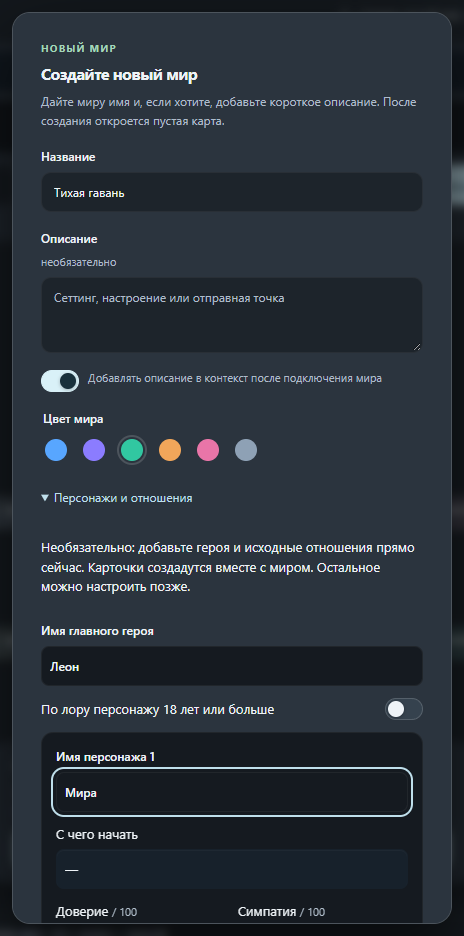</p>

</details>

## Выберите следующий ход

DeepSeek может предложить четыре способа продолжить сцену. Нажатие переносит выбранный текст в поле сообщения — **его можно исправить, а отправляете вы сами**. Стрелки переключают варианты, клавиши 1–4 выбирают нужный.

Варианты получают подключённую память мира и напоминание соблюдать её правила, включая стиль текста. Обязательные правила, например эмодзи в конце реплик, храните в режиме **Всегда**. DeepRole эмодзи не удаляет, но сама модель иногда может пропустить инструкцию.

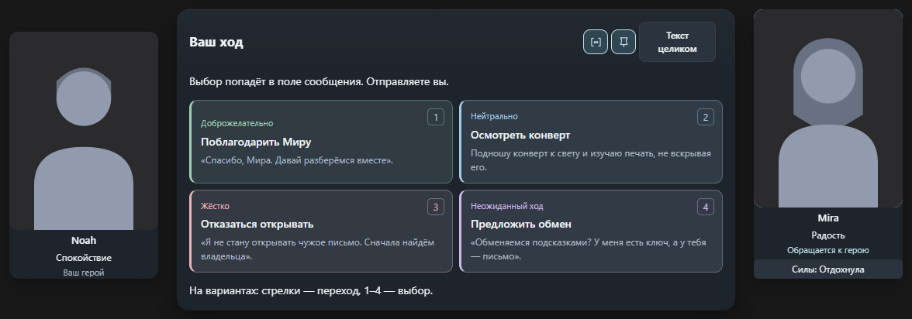

Пока DeepSeek пишет историю, портреты остаются видны. Служебный JSON скрывается за плашкой подготовки. Автопрокрутка продолжает следить за подготовкой вариантов; прокрутка вверх останавливает слежение, возвращение вниз возобновляет его до окончания генерации. **«Предложить варианты»** доступно, если готовый ответ остался без них. При возвращении в чат сохранённые варианты восстанавливаются, если их удалось прочитать.

<details>
<summary>Варианты ответа крупнее</summary>

Ширина вариантов совпадает с полем сообщения. Закреплённое окно остаётся над вводом; после последнего ответа добавляется место, чтобы его можно было дочитать. Перетащите портрет к левому или правому краю вариантов — он примагнитится; на узком экране портреты располагаются компактно. **−** сворачивает варианты, **□** возвращает ту же карточку, не меняя черновик. В следующей сцене новые варианты открываются.

Прокрутка вверх отключает удержание с первого движения; возврат вниз включает его снова. Колесо работает и над закреплёнными вариантами: длинное окно прокручивается внутри, а на его границе прокрутка передаётся чату.

<p>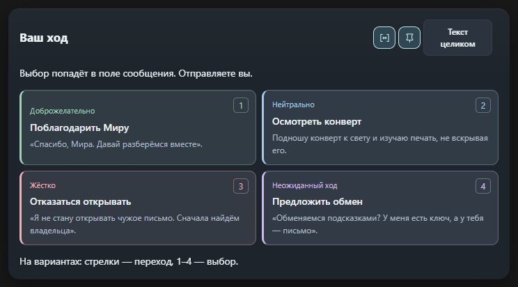</p>

</details>

## Верните скрытый ответ и продолжайте сцену

Если DeepSeek заменяет видимый ответ фразой «Sorry, that's beyond my current scope. Let's talk about something else.», DeepRole автоматически показывает последний сохранённый фрагмент с небольшой меткой **Восстановлено**. Локальные копии привязаны к этому чату и остаются видимыми после перезагрузки. Функция включена по умолчанию; переключатель находится в **Настройки → Приложение → Восстановление ответов**.

**Восстановление также возвращает фрагмент в контекст разговора.** Следующее обычное сообщение в этом чате передаст восстановленный текст вместе с вашим ходом и текущей памятью мира. Дополнительное нажатие или отдельный запрос к модели не нужны. Подключённый мир для этой функции необязателен.

| Шаг | Что делает DeepRole |
| --- | --- |
| Видимый ответ заменён заглушкой | Показывает последний захваченный текст и сохраняет локальную копию. |
| Вы отправляете следующий ход | Добавляет фрагмент как цитату предыдущего ответа. Если запрос содержит ID предыдущего сообщения, разные ветки не смешиваются. |
| Сетевой запрос прошёл успешно | Показывает **Восстановлено · контекст передан** и сохраняет отметку передачи. |
| Вы перезагружаете страницу или играете дальше | Копия остаётся видимой; переданный фрагмент не добавляется снова к каждому ходу. Сетевой сбой до принятия запроса оставляет его для следующей отправки. |

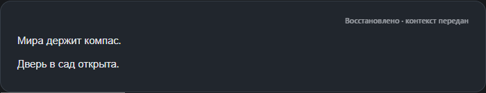

Фрагмент может быть неполным. Ответ, которого расширение не видело, восстановить нельзя. Передаётся последний подходящий восстановленный ответ; для очень длинного текста — последние **64 000 символов**, а полная локальная копия остаётся целой. Анализ лора и другие служебные запросы не расходуют ожидающий фрагмент. Выключение восстановления или закрытие сейфа останавливает и передачу.

Исходный ответ на сервере не переписывается: фрагмент добавляется к вашему новому запросу. DeepSeek получает текст, на который можно сослаться, но понимание модели и отсутствие нового отказа не гарантируются. Копии и отметки передачи входят в полную резервную копию DeepRole и защищаются сейфом, если он включён. Пример выше снят на вымышленной сцене в автоматической браузерной проверке, без живого аккаунта DeepSeek.

## Персонажи, изображения и эмоции

Палочка в панели персонажей готовит анкеты из сохранённого лора в отдельном временном чате. Мини-окно открывается справа сверху от панели: его можно переместить за заголовок и вернуть кнопкой со стрелкой. Лёгкая анимация и меняющиеся подсказки показывают ожидание, а не выдуманные проценты. Если DeepSeek заменяет уже полученный **полный код анкет** отказом, DeepRole сохраняет его для проверки; перезагрузка служебной вкладки не дублирует запрос. Незавершённый или не полученный ответ восстановить нельзя. Без полного ответа анкеты не меняются; готовые данные сохраняются только после подтверждения. [Подробности подготовки →](CHARACTERS.md)

В редакторе четыре вкладки: **Анкета**, **В сцене**, **Отношения** и **Изображения**. Анкета общая для мира; настроение, цели и сыгранный прогресс относятся к чату. Переключение вкладок не теряет черновик, а после сохранения окно остаётся открытым.

Загрузите пачку в **Библиотеку изображений**, затем выбирайте картинки и назначайте эмоции без повторного открытия проводника. Одну картинку можно использовать для нескольких эмоций, а одной эмоции — назначить несколько портретов. Они показываются по циклу без повтора, пока не закончится набор.

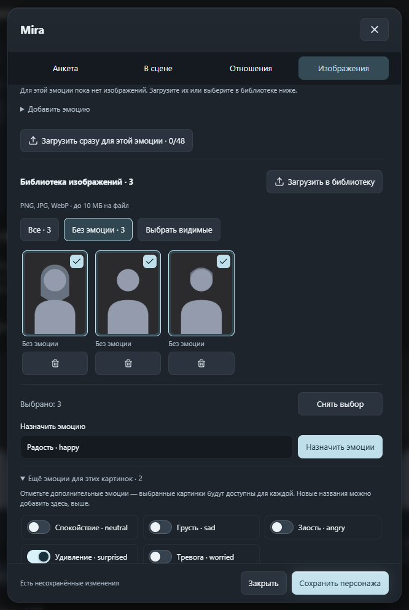

- Новую эмоцию можно добавить прямо в **Изображениях**, а список мира находится в **Настройки → Персонажи**. До 32 активных эмоций для модели; локальные коллекции изображений без ограничений размера и количества.
- Встроенные эмоции показывают подпись и ключ, например **Радость · happy**. Пользовательские названия автоматически не переводятся. Для общей картинки отметьте дополнительные эмоции переключателями: запятая или слэш в названии не создают отдельные эмоции.
- **Доступные эмоции** позволяют выключить отдельные настроения для конкретного персонажа. Изначально разрешены все эмоции мира, а спокойствие доступно всегда. DeepSeek получает личный список. Если он вернул запрещённую эмоцию, DeepRole оставит прежнюю допустимую или спокойствие; остальные корректные изменения сохранятся.
- Переключатели сразу видны в **Изображения → Доступные эмоции**. Выключение снимает все портреты с эмоции после сохранения персонажа. Картинки остаются в библиотеке или других назначенных эмоциях; повторное включение не возвращает старые привязки. Удаление эмоции из списка мира и сохранение также отвязывают её портреты во всём мире. Отсутствие портрета само по себе не запрещает настроение. Локальная проверка не гарантирует, что модель не опишет его в сюжетном тексте.
- Потяните портрет к левому или правому краю вариантов — он примагнитится. Можно двигать и менять размер вручную. После ухода вариантов из виду сохраняется последняя позиция портрета на экране. Собеседники показываются крупнее; остальные персонажи сцены — справа от них, примерно на 15% меньше и с выравниванием по низу. Если говорят несколько персонажей, их портреты одинакового основного размера.
- Потяните угол портрета, чтобы увеличить карточку до высоты окна. Этот портрет становится независимым от автоматической группы и закрепления; размер сохраняется после обновлений сцены и перезагрузки. В узком окне он временно уменьшается без потери выбранного размера. Сброс расстановки возвращает автоматическую группу.
- Маленькая **кнопка-глаз** рядом с управлением панелями скрывает или показывает все портреты, не удаляя картинки и не сбрасывая расположение. Тот же переключатель есть в **Настройки → Персонажи**.

### Необязательная генерация изображений

В **Настройки → Изображения** подключите свой API, разрешите доступ и загрузите актуальный список моделей. В DeepRole нет предустановленного провайдера, каталога моделей или цен. Для обычных иллюстраций и неоткровенной романтики можно выбрать разные подключения. Генерация по умолчанию выключена. Иллюстрации создаются по нажатию; запрошенное селфи может создаться после согласия персонажа. Правила провайдера и законодательство сохраняются; расширение показывает отказ, не пытаясь его обойти. Персонажи должны быть вымышленными.

**С чего начать?** Для готового native-адаптера получите ключ в [кабинете Venice API](https://venice.ai/settings/api). В DeepRole выберите **Venice native API**, укажите `https://api.venice.ai/api/v1` — не адрес сайта и не полный путь генерации. Сохраните ключ, разрешите доступ и нажмите **Загрузить модели**. Выберите модель генерации и модель редактирования для референсов. Сохраните подключение, назначьте его нужному набору и включите генерацию. Дополнительный JSON сначала оставьте `{}`. API может быть платным: проверьте условия сервиса. [Официальная инструкция по ключу](https://venice.ai/blog/how-to-use-venice-api), [актуальный каталог моделей](https://docs.venice.ai/api-reference/endpoint/models/list).

Альтернатива — [OpenAI Images API](https://developers.openai.com/api/docs/guides/image-generation), для него в DeepRole есть одноимённый формат. Совместимость сервиса с чатами OpenAI ещё не означает поддержку изображений и референсов. [Пошаговое подключение и помощь с ошибками →](IMAGE-GENERATION.ru.md#где-брать-изображения-и-api)

**Для аватарок API не нужен.** Создайте и скачайте портреты в веб-инструменте, например [Adobe Firefly](https://helpx.adobe.com/firefly/web/work-with-images/generate-images/generate-images-from-text-descriptions.html), либо используйте свои рисунки. Загрузите PNG, JPG или WebP в библиотеку персонажа и назначьте эмоции. Для похожего лица берите один базовый портрет и делайте варианты выражений по этому референсу; точность всё равно зависит от генератора. Готовые загруженные фото показываются локально, без повторной генерации.

Кнопка **Создать иллюстрацию** находится под завершённым ответом истории. Внешность, текущая сцена, стиль и seed задаются отдельно; референсом может быть любая загруженная картинка персонажа. Окончательное описание можно прочитать в подробностях готового снимка. Результат остаётся у этого ответа, переживает перезагрузку, открывается крупно и удаляется отдельно. Автоматических платных повторов нет. Ключи хранятся отдельно и не экспортируются; иллюстрации входят в бэкап и пакет мира. [Подключение, форматы, лимиты и приватность →](IMAGE-GENERATION.ru.md)

Повтор иллюстрации теперь остаётся в одной карточке: назад/вперёд листают сохранённые генерации этого сюжетного ответа без вызовов API. Снимок сохраняет пиксельные размеры сервиса, которые показаны под превью; крупный просмотр поддерживает масштаб 100%. Явные параметры размера подключения больше не перезаписываются. Прежние уже уменьшенные фото автоматически восстановить нельзя.

В **Настройки → Изображения** включите **Проверять референсы перед генерацией**. После скрытой подготовки кадра появятся участники с миниатюрами и кнопками **Авто / Обычный / Альтернативный**. Выбор действует только для этой картинки. По **Создать изображение** DeepSeek скрыто уточнит описание, если вы переключили вариант; DeepRole закрепит выбранные фото перед отправкой генератору. Отмена не отправляет запрос изображений; ожидающая проверка сохраняется после перезагрузки. По умолчанию настройка выключена — остаётся генерация одним нажатием. **Изменить референсы** под результатом готовит новую проверку, а **Попробовать ещё раз** повторяет исходный запрос. В анкете персонажа можно закрепить **Выбор референса**; «Авто» учитывает фактический образ в кадре, отсутствующий альтернативный заменяется обычным.

### Селфи и просмотр изображений

Есть два способа получить селфи. **Готовые подборки** показывают уже загруженные снимки — **это не генерация ИИ**. Вы сами просите фото кнопкой **Попросить селфи** или сообщением в чате; DeepSeek отыгрывает согласие или отказ и выбирает подборку. **Генерация ИИ** создаёт новую картинку через отдельно включённый сервис изображений и может оплачиваться по его тарифу. Подходящие готовые снимки используются первыми.

В **Персонаж → Изображения → Готовые подборки селфи** создайте подборки: название, описание ситуации и фотографии. **Добавить фото** загружает файлы, а **Выбрать из библиотеки** позволяет отметить сразу несколько уже загруженных изображений этого персонажа, включая портреты и постоянные референсы. Нажмите **Добавить выбранные**, затем **Сохранить персонажа**. Привязки к эмоциям и референсам сохраняются; одинаковое фото не добавляется повторно. Удаление фото из подборки не удаляет его источник из библиотеки. Одну подборку отметьте как **Обычную категорию**. DeepSeek выбирает её по сыгранной сцене; если совпадения нет, использует обычные селфи. Модель получает названия, условия и доступность категорий; сами картинки остаются локальными.

Для категории задаются пороги доверия и близости (шкала симпатии), изначально **40 / 30**. При настроенном учёте отношений с главным героем низкие сохранённые значения блокируют фото. Достигнутые пороги не гарантируют согласие: персонаж может отказать или отложить отправку по характеру, границам и ситуации. Без числового учёта согласие определяется историей. Отказ, обещание на потом и несыгранный вариант ответа не прикрепляют фото.

После завершённого ответа с корректным событием фото появляется внутри него примерно через **1,5 секунды**. Оно привязано к сообщению и восстанавливается после перезагрузки в том же браузере с той же библиотекой. Если исходное изображение удалить, появится пояснение об отсутствии фото. Размер и число локальных фото и подборок не ограничены DeepRole. Прежние назначения эмоциям **Селфи / Selfie** тоже поддерживаются.

Нажатие на аватарку, селфи или иллюстрацию открывает крупный просмотр. **Колёсико** или **+/−** увеличивают до **128×**, перетаскивание перемещает картинку. Есть **100% / Вписать в окно**; уменьшение останавливается на вписанном размере. Клавиши: **+/−**, **0** — 100%, **F** — вписать, **Escape** — закрыть. Зум увеличивает сохранённые пиксели, но не восстанавливает утраченные детали. Имя на плавающем портрете по-прежнему открывает анкету.

### Чёткие загрузки и крупные превью

Новые изображения сохраняются до **1920 px по длинной стороне**, вместо прежних 384 px. В **Настройки → Оформление → Качество загруженных изображений** выберите готовое значение или своё целое число от **256 до 4096 px**. Пропорции сохраняются, маленькие исходники не растягиваются. Подходящий PNG/JPG/WebP сохраняется без пересжатия; большие картинки уменьшаются в качественный WebP. Настройка действует на загрузку портретов, селфи и референсов, но не на разрешение результата API. Старые уменьшенные фото нужно загрузить заново из оригиналов.

В **Персонаж → Изображения → Библиотека изображений** двигайте **Размер превью**, чтобы увеличить миниатюры до 280 px. Размер запоминается; **Просмотр** открывает полную картинку, не меняя выбор и назначения. DeepRole не ограничивает общий размер и количество локальных изображений; доступный объём зависит от свободного места и браузера. Старые картинки не меняются.

<details>
<summary>Настройка качества, крупная библиотека и просмотр с зумом</summary>

<p>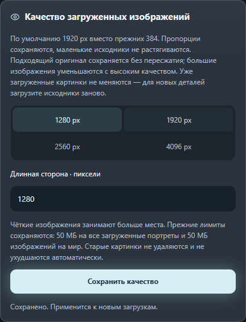</p>
<p>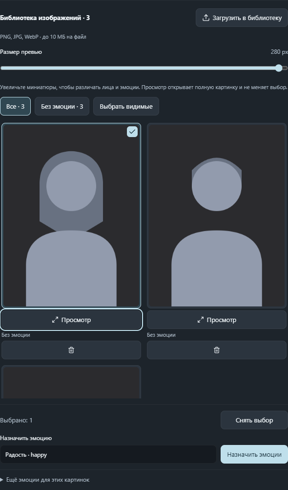</p>
<p>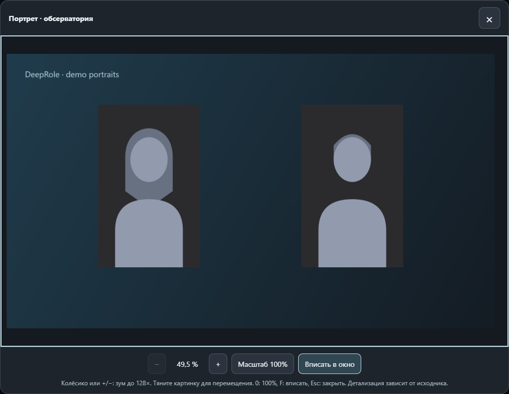</p>

</details>

<details>
<summary>Пример: личный список эмоций персонажа</summary>

<p>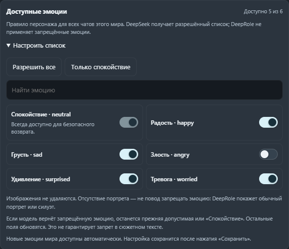</p>

</details>

## Отношения и последствия, которые сохраняются

**Доверие** и **Симпатия** — две отдельные шкалы от 0 до 100. Показывайте числа, стадию — **Настороженность → Знакомство → Доверие → Близость** — или оба варианта. Персонаж может испытывать симпатию к герою, но ещё не доверять ему.

Задайте каждому персонажу начальные значения, характер, границы и темп изменений. Важные события могут быть условиями сближения или отдельными достижениями. Можно описать поведение на каждой стадии: общего правила «добрый ответ = +5» нет.

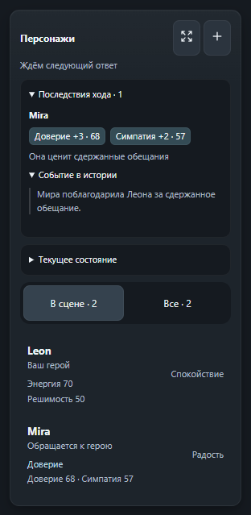

- После сыгранной сцены DeepSeek предлагает небольшие изменения с причиной и цитатой. DeepRole проверяет ответ, привязку, темп и повтор доказательства перед сохранением. Показ вариантов или подготовка лора не начисляют очки.
- **«Последствия хода»** показывают реальные изменения и их причины. **«Текущее состояние»** объясняет значения и недостающие условия, чтобы прогресс был понятным.
- Правьте числа, отмечайте события вручную или фиксируйте прогресс в этом чате. Журнал хранит последние 20 изменений. Отмена последней правки модели готовит исправление в редакторе; проверьте его и сохраните сами.
- Добавляйте до шести **Характеристик**: например, энергию, решимость или смелость. У каждой — шкала 0–100, старт, смысл низкого и высокого значения, предел изменения и фиксация. Прежние текстовые показатели не превращаются в числа без вашего участия.
- Начальные настройки общие для мира; сыгранные значения относятся к этому чату и герою. Обычный новый чат начинает с заданного старта. **«Продолжить в новом чате»** переносит достигнутый прогресс.

Система **включена по умолчанию**. Выключить её можно в **Настройки → Персонажи** — числа и история останутся. У старых персонажей без числовой настройки прежний лор сохраняется.

Романтика необязательна и выключена, пока вы её не настроите для персонажа. Личные условия, добровольность и границы остаются важны: **высокие числа — не согласие**. Это ориентиры для DeepSeek, не гарантия его ответа; расширение не переписывает возраст в вашем лоре.

<details>
<summary>Примеры: настройка отношений и характеристика</summary>

<p>Задавайте старт отдельно от текущих отношений в чате.</p>
<p>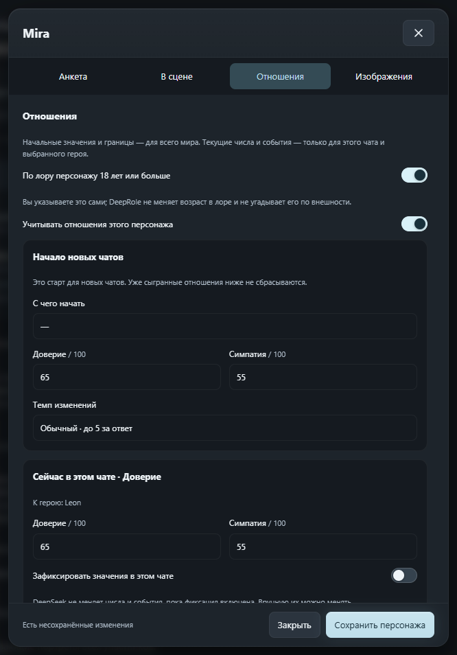</p>
<p>Опишите, что означает характеристика, а не только её название.</p>
<p>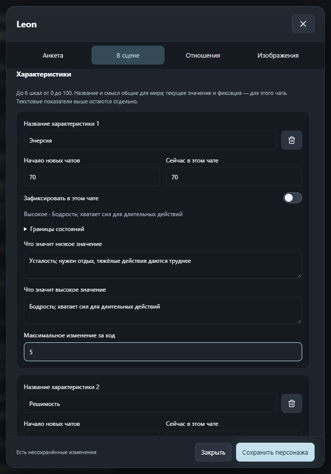</p>

</details>

[Подробнее об отношениях и характеристиках →](RELATIONSHIPS.ru.md)

## Порядок в лоре и контроль изменений

У каждого мира свои записи, профили и память. Пользуйтесь списком для прямого редактирования или **Картой мира** для ветвей, разделов и связей. Это одни и те же записи. Ищите, перетаскивайте узлы, открывайте карту на весь экран, сравнивайте два мира рядом или отменяйте правки расположения.

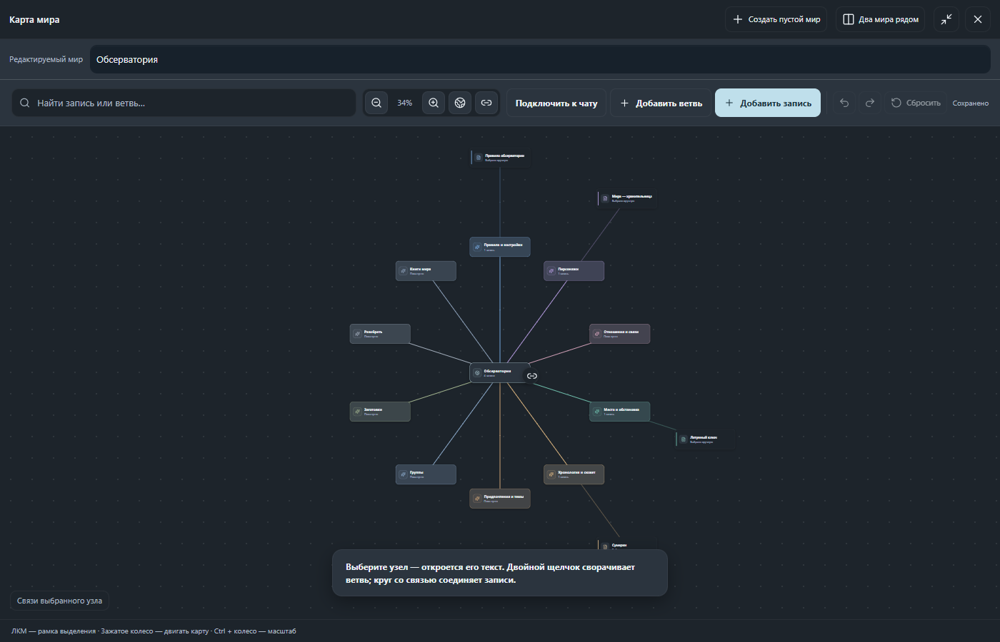

**«Обновить лор»** просит DeepSeek предложить важное для памяти после сцены. Проверьте **Было → Станет**, исправьте текст и сохраните только выбранное. До подтверждения предложения не становятся частью лора.

Наведите мышь на кнопку с мозгом возле поля сообщения: обычная браузерная подсказка объяснит **«Обновить лор»** и проверку предложений перед сохранением. Если DeepSeek занят, там же указана причина временной недоступности.

Для постоянной правки откройте персонажа и нажмите **«Изменить постоянный факт»** — например, чтобы изменить цвет волос. DeepRole проверит все записи подключённого мира и попросит предложить замены в лоре и анкете. Вы подтверждаете правки; старые сообщения чата не переписываются, а косвенные упоминания модель может пропустить.

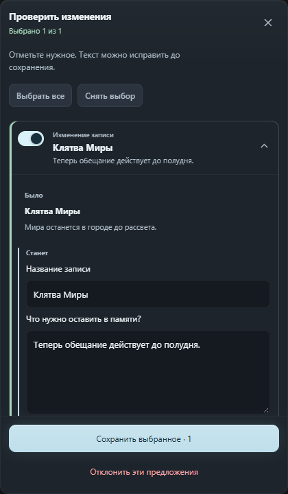

### Что отправится вместе с сообщением?

Откройте **«Контекст»**, чтобы проверить память следующего сообщения, прикрепить недостающую запись или исключить лишнюю.

| Режим памяти | Когда запись подключается |
| --- | --- |
| **Всегда** | С каждым сообщением в своей области памяти. Подходит для коротких обязательных правил. |
| **Автоподбор** | При совпадении имён, ключевых слов и контекста сцены, в пределах лимита автоподбора. Подбор локальный, без отдельного ИИ. |
| **Вручную** | Только когда вы прикрепите запись к этому чату. |

Не поместившиеся записи **не удаляются**. В следующей сцене подбор может измениться. Записи «Всегда» и ручные прикрепления могут выходить за лимит автоподбора, поэтому перед подключением большого объёма проверьте предупреждение.

**Индикатор контекста чата** оценивает размер переписки, а плашка **«Контекст»** — подключённой памяти. Это разные показатели, не счёт за токены от DeepSeek.

<details>
<summary>Пример: проверка подключённой памяти</summary>

<p>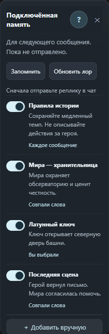</p>

</details>

## Спокойный и адаптивный интерфейс

В **Настройки → Оформление** появился переключатель **Показывать размышления автоматически**. По умолчанию ход мыслей свёрнут, а строка «Думал … секунд» остаётся доступна: нажмите её, чтобы раскрыть один ответ. Ручное раскрытие не сбрасывается при дописывании этого ответа; следующие ответы снова свёрнуты. Включение настройки возвращает обычное отображение DeepSeek во всех чатах. Сам режим **Глубокое мышление**, запросы и история не меняются; настройка сохраняется после перезагрузки.

Графитовые поверхности, светло-голубые акценты, мягкое свечение важных действий, переключатели в стиле iOS, единые выпадающие меню и тонкая тёмная прокрутка. Второстепенные кнопки спокойнее; анимацию можно выключить, а системное уменьшение движения учитывается.

Плавающие панели под названием чата одинаковой ширины: **224 px по умолчанию**, общая регулировка от **200 до 360 px** на панели инструментов или в **Настройки → Приложение → Панели и сцена**. Между панелями — 1 px. Перетаскивайте за неинтерактивную область или двигайте весь набор постоянно видимой ручкой. Сброс возвращает его под актуальный заголовок чата; при закрытии боковой панели DeepSeek он плавно занимает освободившееся место.

**Адаптивный размер включён по умолчанию.** В узком окне панели превращаются в компактные кнопки, а портреты — в ряд, вместо перекрытия большими карточками. Ручные размеры сохраняются.

Две отдельные мини-кнопки на вариантах закрепляют **оба портрета сразу** или **сами варианты**. Закреплённые варианты остаются по центру над полем сообщения при прокрутке, изменении ширины окна и росте черновика. Если они готовы, пока вы читаете выше, закреплённая карточка появится на экране. Длинные карточки прокручиваются внутри. Без закрепления они движутся вместе с историей и не прячутся за полем ввода внизу чата.

<details>
<summary>Пример: общая ширина, адаптация и закрепление</summary>

<p>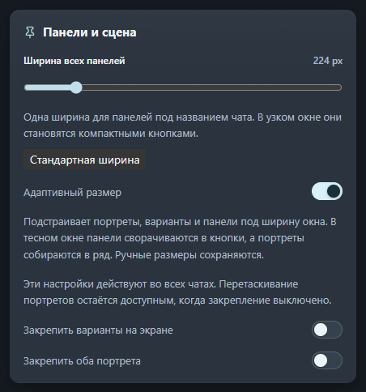</p>

</details>

## Продолжите в новом чате

Нажмите **«Продолжить в новом чате»**: сначала DeepSeek сравнит переписку с памятью DeepRole и предложит изменения. Сохраните нужные правки или явно выберите продолжение без изменения памяти. Затем DeepSeek подготовит скрытую сжимку последних сцен — только после её готовности откроется новый чат и получит сжимку с просьбой продолжить с того же момента. **Старый чат не удаляется.** Мир, портреты, выбранная память и точный сохранённый прогресс персонажей переносятся.

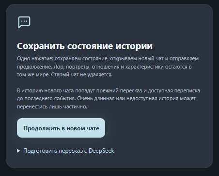

Сжимка передаётся в контексте первого запроса; DeepRole показывает в чате только просьбу продолжить, в том числе после перезагрузки. Полная переписка не дублируется в новом чате. Недоступные события не додумываются, а пересказ модели может упустить детали — важные факты лучше сохранять в подтверждённой памяти мира. В сохранённом состоянии есть ссылка на исходный чат.

Несохранённый черновик и текущая генерация защищены. Если автоматическая отправка недоступна, отправьте подготовленное продолжение сами. При ошибке отправки оно остаётся готово для повтора. **«Подготовить пересказ с DeepSeek»** по-прежнему доступно отдельно, по желанию.

При приближении к заданному объёму чата необязательное предупреждение появляется примерно на **90% и 97%**. Сообщения оно не блокирует; выключается в **Настройки → Приложение**. Это локальная оценка, а не предсказание, что DeepSeek остановится ровно через два сообщения. Ориентировочный объём чата задаётся отдельно от лимита подключённой памяти.

<details>
<summary>Пример: предупреждение о заполнении чата</summary>

<p>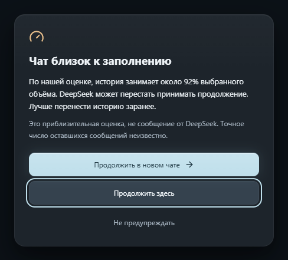</p>

</details>

## Резервные копии и перенос на другой компьютер

### Один JSON — целый мир с лицами персонажей

**Картинки действительно лежат внутри JSON.** Портреты эмоций и их варианты, неназначенные фото библиотеки, готовые подборки селфи и изображения постоянных референсов переносятся как сами данные картинок, не ссылки на сайт. Сохранённые иллюстрации тоже. Почти магия: импортируете один файл — и у персонажей снова есть лица, без отдельной папки фотографий и облака.

1. Откройте **Настройки → Файлы и защита → Экспорт**.
2. Выберите **Этот мир**, нужный мир и нажмите **Скачать файл**.
3. На другой установке откройте **Лор → Загрузить готовый лор** или **Настройки → Файлы и защита → Импорт**, выберите JSON и подтвердите импорт мира.

Переносятся сохранённые версии картинок, не отброшенные оригиналы загрузки. Несохранённые изменения анкеты сначала сохраните. Чем больше фото, тем тяжелее JSON. Не публикуйте личные миры: обычный экспорт мира не защищён паролем. Ключи и подключения API не входят в файл; это также не экспорт всей переписки DeepSeek. Для сохранённого прогресса чатов и всех настроек расширения используйте **Полную резервную копию** ниже.

| Что сохранить | Что переносится |
| --- | --- |
| **Экспорт мира** | Лор этого мира, анкеты, изображения, эмоции, личные запреты эмоций, настройки отношений и начальные характеристики. Не сыгранный прогресс отдельных чатов. |
| **Полная резервная копия** | Все миры, записи, настройки, сохранённые состояния чатов и достигнутый прогресс персонажей. Выбирайте её для переезда на другой ПК. |

Выберите **Настройки → Файлы и защита → Экспорт → Полная резервная копия**, оставьте скачанный файл в безопасном месте и импортируйте его в DeepRole на другом компьютере. Копию можно защитить паролем. При восстановлении можно добавить недостающие записи или явно заменить всю библиотеку.

**Не удаляйте расширение ради обновления.** Сначала сделайте копию, замените файлы в папке, которую загрузил браузер, перезагрузите DeepRole на странице расширений и обновите DeepSeek. Сборка проекта сама не обновляет отдельно распакованную папку.

Также можно импортировать записи памяти из [Better Deepseek (BDS)](https://github.com/EdgeTypE/better-deepseek). Этот импорт не содержит портретов DeepRole или сыгранного прогресса персонажей. Архивы GitHub содержат расширение, не ваши личные миры.

## Приватность и благодарности

Лор, портреты и прогресс хранятся в браузере. Выбранный текст и служебные запросы уходят в DeepSeek, но не байты портретов. Если отдельно включить генерацию изображений, выбранный вами провайдер получит окончательное описание и отмеченные референсы только по нажатию. У DeepRole нет отдельного сервера памяти и телеметрии.

Необязательный сейф защищает локальные данные расширения. Он не шифрует уже отправленные DeepSeek сообщения и прежние обычные файлы копий. Данные браузера можно очистить или потерять, поэтому храните свои резервные копии. [Подробнее о приватности →](../PRIVACY.md)

С уважением и благодарностью к [Better Deepseek (BDS)](https://github.com/EdgeTypE/better-deepseek) — независимому открытому расширению, чей формат памяти поддерживает DeepRole. DeepRole не является его официальной версией или продуктом DeepSeek.

## Дополнительная помощь

- [Скачать актуальные архивы](../downloads/README.md)
- [Установка и обновление](../INSTALL.md)
- [Отношения и характеристики](RELATIONSHIPS.ru.md)
- [Персонажи и портреты](CHARACTERS.md)
- [Варианты ответа](SCENE-CHOICES.md)
- [План развития и результаты проверок](../ROADMAP.md)

## Для разработки

Нужны Node.js и npm.

```sh
npm ci
npm run typecheck
npm test
npm run test:e2e
npm run build
npm run build:firefox
```

Исходники и тесты — в этом репозитории, готовые архивы — в [downloads](../downloads/README.md). Автоматические проверки используют вымышленные сцены и не заменяют проверку на живом аккаунте DeepSeek: при изменении сайта расширению может понадобиться обновление.
